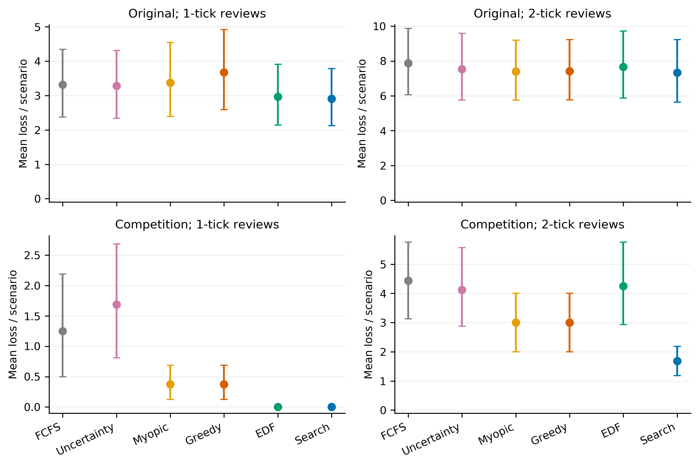
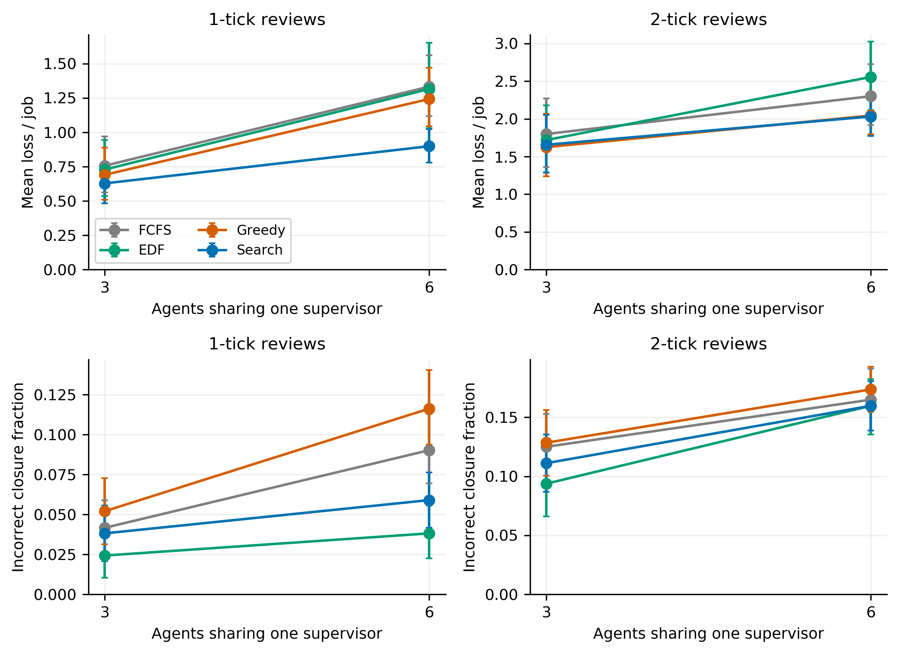
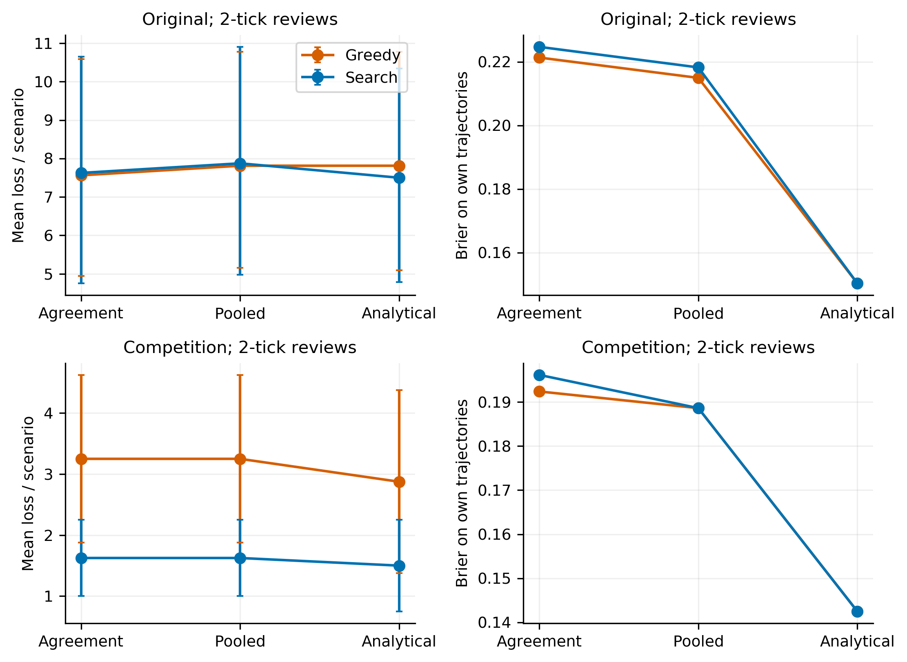
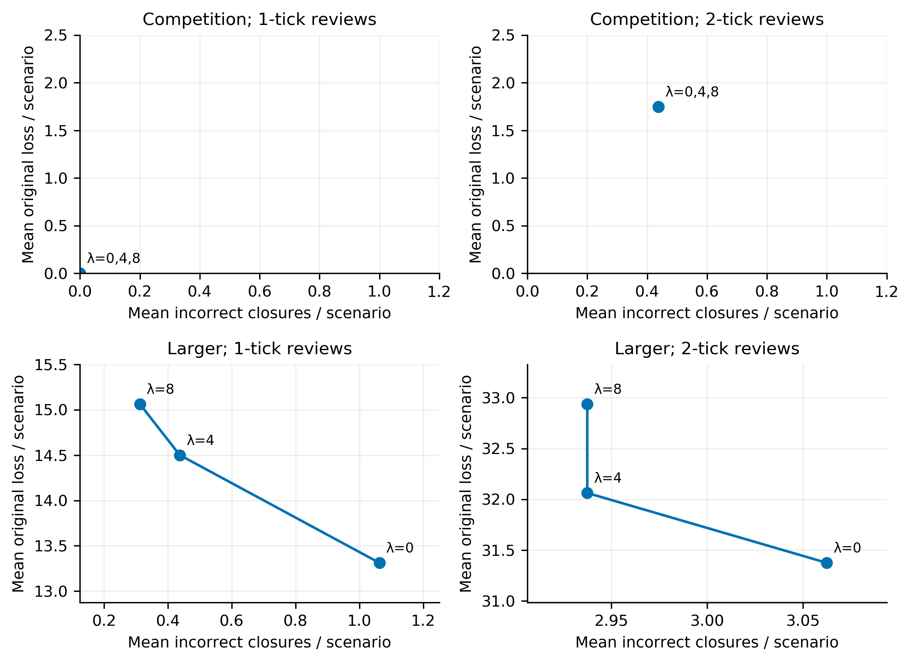

# Planning a shared review queue for synthetic LLM maintenance agents

Research draft based on a completed, frozen Stage 4 evaluation. All claims concern synthetic maintenance and simulated supervision; this is not a finished submission or a human study.

## Abstract

We investigate when planning a shared review queue helps several language-model agents performing civilian synthetic maintenance. One simulated supervisor reviews requests with deadlines, continuing downtime costs and terminal incorrect-closure penalties. A frozen experiment compares simple schedulers and exact current-queue search, public risk estimates, team sizes and review durations. All 2,752 evaluation episodes complete with fresh Qwen2.5-7B-Instruct GPU generations. At two-tick reviews, search minus greedy mean loss is −1.3125 (95% paired interval [−2.2500,−0.4375]) in a constructed competition workload, but −0.09375 [−0.5625,0.34375] in the original workload. EDF matches search's zero loss when one-tick service can preserve every competition request. A synthetic analytical risk reference improves prediction scores without consistently improving rollout loss. In a larger one-tick workload, adding an incorrect-closure penalty reduces errors while raising original cost; the effect weakens at two ticks. The contribution is an auditable framework and measured analysis of these interactions, including negative results, not a novel exhaustive scheduling algorithm or evidence about real human performance.

## 1. Research question and motivation

When several LLM agents share one reviewer, a useful intervention may arrive too late. Ranking requests by their individual expected benefit can sacrifice opportunities that a different sequence would preserve. Conversely, planning can provide little benefit when contention is rare, or allocate attention poorly when its estimated error risks are inaccurate. A lower weighted maintenance cost can also coexist with more incorrect job closures. We ask when planning review order matters, how public risk information changes allocation, and how capacity and objective choice qualify the conclusions.

The setting is civilian synthetic campus ventilation maintenance. A binary hidden fault requires one of two repairs. There is one simulated supervisor, finite review duration, perfect diagnosis on completed review, and immediate compliance. These simplifications isolate scheduling mechanisms; they do not represent measured human behavior, real equipment performance, or general LLM alignment.

Stages 1–3 supplied development evidence. Stage 1 established GPU integration and a zero-loss four-policy tie. Stage 2 found identical greedy/search sequences and slightly lower FCFS losses. Its eight original-distribution validation scenarios were too small and rarely competitive. Stage 3 deliberately released simultaneous review waves. Search beat greedy in aggregate weighted loss but tied EDF at one-tick reviews; at two ticks it left more jobs incorrect than greedy. These observations motivated the present predeclared replication, risk comparison, capacity study, and objective extension. Historical results and their source snapshots remain preserved.

## 2. Formulation and information boundary

Job i has release r_i, deadline d_i, downtime cost c_i, and terminal cost K_i. While its executed action differs from the fault-specific correct repair, it incurs c_i per simulated tick; an incorrect closure incurs K_i. Episode loss is

`L = Σ_i { c_i Σ_(t=r_i)^(d_i−1) I[a_i(t) ≠ a_i*] + K_i I[a_i(d_i) ≠ a_i*] }`.

Correct-closure count is a separate outcome. In particular, a job with c_i=K_i=0 may close incorrectly without contributing to L. Completed review at T can prevent `G_i(T)=I[T≤d_i]{c_i(d_i−T)+K_i}` if the initial action is wrong. Completion exactly at the deadline can avoid terminal loss but cannot erase earlier downtime.

The agent sees only its released job's public parameters, two clues, the task manual, and its own action/review history. The first clue matches the fault with probability 0.8 and the second with probability 0.6, independently given the fault; the fault prior is uniform. The model produces two freshly sampled repair actions for the same observation. The first executes; the second supplies an agreement feature. All proposals request review automatically. Wrong valid actions are preserved. Hidden faults are available only for offline analysis, scoring, and diagnosis when supervision completes.

Schedulers receive immutable public pending-request records, including estimated initial-error probability p_i, proposal, arrival, costs, deadline, and review duration. Search sees no unreleased jobs or future arrivals. A single nonpreemptive reviewer serves one request at a time. Tick order is completed reviews, deadline closures, job releases and model calls, dispatch, then interval scoring. Inference latency pauses the simulation clock. Each policy/duration/risk condition has its own model calls and within-episode histories.

## 3. Policies, risks, and extension

All core policies share a positive-benefit eligibility check at earliest completion t+s. FCFS selects the earliest request; uncertainty-first the greatest p_i; myopic benefit the greatest p_i G_i(t); delay-aware greedy the greatest p_i G_i(t+s); EDF the earliest deadline. The shared deterministic tie rule uses request time, agent ID, and job ID. Queue-order search enumerates every ordered subset of the currently eligible queue, maximizes `Σ_k p_(i_k) G_(i_k)(t+k s)`, executes its first review, and replans when free. It is exact for this finite current-queue objective, not an oracle for future arrivals or realized faults. Ties in computed floating-point values prefer fewer reviews, then lexicographic request order. Six eligible requests yield 1,957 ordered subsets including empty; queues are checked, never truncated.

A pre-evaluation validity repair replaces order-dependent sequential floating-point summation with `math.fsum` in the Stage 4 search path. A saved development state had equal mathematical totals but differing rounded values across permutations. Historical implementations remain available for historical replay and audits. This repair preserves the declared objective and tie preference; it is documented in the decision log. On 1,920 saved Stage 3 dispatch states, it changes 42 hypothetical search first choices, all at one-tick reviews, and none at two ticks. This is a same-state audit, not a rerun of historical trajectories. A further exact-rational audit of 4,001 saved Stage 4 development states found no loss of expected value from the selected search head, but four differences from the canonical exact tie preference. Uniform risk rescaling changed ten hypothetical choices among 1,771 uniform-risk states; all were exactly co-optimal. Thus exhaustive enumeration is not a claim of exact rational tie arithmetic, and such changes carry no new risk-ranking information. The frozen execution is retained; the same audit is applied to evaluation.

Three immutable public risk rules are compared. The primary historical estimator is the exact Stage 2 artifact: agreement predicts 13/89; disagreement uses pooled fallback 18/98 because its calibration bin contained only nine observations. Its calibration labels concern initial first actions before correction, irrespective of whether reviewed. The pooled alternative uses 18/98 for every request. Neither is refitted.

The analytical reference knows the synthetic prior and observation likelihoods. It computes the posterior probability that the first proposed repair is wrong given the public clues. Following agreeing clues yields 1/7; following the stronger clue when they disagree yields 3/11. Choosing the opposite repair yields 6/7 or 8/11 respectively. Public costs and IDs add no fault information under the generator. This is an informed synthetic reference, not an automatically available deployment estimator. The second model sample is retained in every condition to keep inference protocol constant.

Development findings selected one optional extension, cost versus correctness. Search adds a declared incorrect-closure penalty λ∈{0,4,8}, replacing K_i by K_i+λ in both eligibility and expected intervention benefit. Original maintenance loss L and incorrect-closure count U remain unchanged in scoring. Comparisons additionally report common objectives L+kU for each fixed k∈{0,4,8} across all λ conditions, rather than comparing unlike own-objective values. The finite grid is a tradeoff study, not a proof of Pareto optimality or universal improvement. No imperfect-supervision or generation-replicate branch was added. With uniform estimated risk and terminal-only costs, adding λ contributes the same `m p λ` to every feasible plan of fixed length m. It therefore cannot change their mathematical ranking. In the three-request competition wave at two-tick duration, at most two reviews can finish usefully and every pair is feasible in an appropriate order. When all three risks coincide, λ has no allocation information to distinguish expected incorrect closures among those pairs. Larger queues with downtime and zero original-cost jobs can behave differently. More strongly, throughout the frozen estimator range and λ grid, `p_max(4+λ) < p_min(8+λ)`; even at λ=8, these bounds are about 2.204 and 2.337. Thus the cost-four request is always the lowest expected-benefit request in a competition wave. At two ticks, any pair is feasible, so search retains the cost-eight and cost-twelve requests across the grid. An exact-arithmetic audit checks all 288 combinations of public deadline/penalty permutations and frozen-risk assignments at both durations and all three λ values (1,728 checks). At one tick, all exact-optimal plans serve all three requests; at two ticks, their usefully served set is always the cost-eight and cost-twelve pair. This gives a structural null control: realized loss differences between these extension conditions cannot by themselves establish an objective-allocation gain. Fresh action variation and its effects on later prompts must be checked.

## 4. Workloads and frozen design

The original generator and Stage 3 generator are unchanged. Both use three agents, two jobs each, and 12 ticks. The competition condition releases three jobs at ticks 0 and 6, independently permutes deadline windows 2/4/5 and terminal penalties 4/8/12 within each wave, and sets downtime cost to zero. It is intentionally constructed after the Stage 2 competition limitation; replication within it does not turn it into a naturally representative task distribution. With zero downtime, myopic and delay-aware greedy have the same shared-state ranking after eligibility.

The separate larger workload uses three or six agents, three jobs each, and 24 ticks. Release waves have bases 0,8,16 plus independent jitter 0/1. Relative deadline windows are sampled from 2/4/6, downtime rates from 0/1/3, and terminal penalties from 0/4/8/12. Independent public-component and hidden-component streams keep costs and arrivals unrelated to faults. Stable per-agent/job streams make the first three agents' exogenous jobs identical across team sizes. Every job closes before the next wave; at most six outstanding requests are possible. Future releases remain hidden from schedulers.

Development used seeds 400–407 for risk pilots, 408–411 for the larger-workload pilot, and 412–415 for one objective-grid pilot. All 304 episodes completed; no seed was selected by favorable outputs. A separate diagnostic preselected 32 historical prompt hashes and made four identical-request repetitions each. It found no new mixed group in those 128 calls, but integrated development again produced a few mixed-action groups. Seeds are controls on requested sampling, not a promise of bitwise regeneration. Replay deterministically scores saved outputs, which is a different reproducibility claim.

The full evaluation was frozen before its first request:

| Study | Scenario seeds | Conditions | Fresh calls |
| --- | --- | --- | ---: |
| Replication | Original 10000–10063; competition 11000–11063 | Six policies; review durations 1/2; frozen risk | 18,432 |
| Risk ablation | First 32 declared seeds from each replication workload | Greedy/search; pooled/analytical; durations 1/2; reuse matching frozen rows | 6,144 |
| Capacity | Larger workload 12000–12031 | Three/six agents; FCFS/EDF/greedy/search; durations 1/2 | 13,824 |
| Objective extension | 13000–13015, each in competition a3 and larger a6 | Search; λ=0/4/8; durations 1/2 | 4,608 |

The evaluation contains 2,752 episodes. Its 64, 64, 32, and 16-per-extension-workload scenario sets are the statistical units; repeated policy/duration conditions are not independent scenarios. Matching numeric extension seeds across its two distributions do not justify pooling them. Policy order rotates and duration order is balanced. Sampling seeds exclude policy, risk, review duration, objective, and execution order. Each actual rollout nevertheless makes fresh GPU calls; supervision can change later prompts.

The model is Qwen/Qwen2.5-7B-Instruct revision `a09a35458c702b33eeacc393d103063234e8bc28`, BF16 on one RTX 6000 Ada, with zero CPU offloading. Decoding retains temperature 0.3, top-p 1.0, 48 maximum output tokens, and guided two-action JSON. Requests are serial, with at most one retry and the existing 60-second attempt timeout. The session ledger caps scheduled calls at 50,000 and actual generation attempts at 60,000. The nine-hour authorization reserves the final 90 minutes for reporting; a watchdog terminates experimental workers at the inference cutoff while preserving the serving process.

## 5. Analysis

The primary contrast is search minus greedy loss at two-tick reviews, separately for original and competition workloads. EDF is a prominent secondary comparator. We report means, paired scenario differences, wins/ties/losses, correct closures, corrections, review utilization, missed opportunities, and per-agent distributions. Scenario-paired percentile bootstrap intervals use 2,000 resamples and analysis seed 20260910. Each resample carries every condition of a scenario together. Intervals are descriptive, without multiplicity adjustment; extension and additional contrasts are secondary.

Brier scores and reliability summaries are computed from initial first-action labels on saved trajectories, by policy, duration, workload, and risk condition. Alternative probabilities can be scored on the same outputs without new generations. Those prediction diagnostics do not establish counterfactual policy effects, which require the fresh risk-specific rollouts. The ablation uses the matching 32-scenario frozen prefix, not all 64 replication rows.

Dispatch diagnostics compare alternative policies on identical saved public states and count multiple-eligible-request opportunities. Actual review sequences are separately compared across rollouts. We count differing observations, differing sampled actions, and differing actions despite identical full requests. Such diagnostics describe intertwined trajectory changes; they do not isolate a pure causal scheduling effect. Planning latency and ordered-subset counts are recorded independently of simulated time.

The declared trace rule selects the first numerical seed where search beats greedy and the first where it loses, at two ticks for each core workload (six agents for the larger workload); if a direction has no example, the first tie is labeled as a fallback. Extension examples use the first seed where λ=8 reduces incorrect closures but raises original cost. Failures are retained, incomplete pairs bounded, and failed seeds never replaced.

## 6. Measured evaluation results

All 2,752 frozen evaluation episodes and 304 development episodes completed and replayed. The complete session used 48,320 successful GPU generations, including 128 diagnostic calls, with no retries, failed attempts, incomplete episodes, or unknown token counts. Results below keep workload distributions and core/extension seed cohorts separate. Full condition-level results, bin counts, per-agent outcomes and declared trace selections are linked from the [Stage 4 report](../reports/STAGE4_RESEARCH.md) and [claim–evidence map](CLAIM_EVIDENCE.md).

### 6.1 Planning depends on the workload and review duration

Mean maintenance loss over 64 paired scenarios per workload/condition is:

| Workload | Review ticks | FCFS | Uncertainty | Myopic | Greedy | EDF | Search |
| --- | ---: | ---: | ---: | ---: | ---: | ---: | ---: |
| Original | 1 | 3.3125 | 3.2813 | 3.3750 | 3.6719 | 2.9688 | 2.9063 |
| Original | 2 | 7.8750 | 7.5313 | 7.4063 | 7.4219 | 7.6563 | 7.3281 |
| Competition | 1 | 1.2500 | 1.6875 | 0.3750 | 0.3750 | 0.0000 | 0.0000 |
| Competition | 2 | 4.4375 | 4.1250 | 3.0000 | 3.0000 | 4.2500 | 1.6875 |

The primary search-minus-greedy difference at two ticks is **−0.09375 [−0.5625, 0.34375]** in the original workload and **−1.3125 [−2.2500, −0.4375]** in competition. Brackets give 95% scenario-paired bootstrap intervals. Search wins/ties/loses in 3/59/2 original scenarios and 15/42/7 competition scenarios. Against EDF, the corresponding differences are −0.3281 [−0.7969, 0.0000] and −2.5625 [−4.0000, −1.3125]. These secondary comparisons are descriptive and not multiplicity-adjusted.

The contention diagnostics help explain the original null. On search's original two-tick trajectories, only 32 of 156 eligible dispatch opportunities contain multiple requests. There are 144 requests with no feasible positive-benefit completion at arrival, 57 zero-value requests, and 27 initially useful requests lost while waiting. Many losses therefore cannot be changed by choosing a different order among the few eligible requests. Actual search/greedy sequences differ in only nine of 64 scenarios.

Competition has 224 competitive dispatches among 256 search dispatch opportunities at two ticks. Search and greedy select different heads on 72 identical saved public states and have different actual review sequences in 53/64 scenarios. All policies complete 256 reviews and leave 128 initially useful requests unreviewed. Search changes which jobs remain exposed: its 27 wrong closures all incur penalty four, giving total loss 108 versus greedy's 192. Search also closes five more jobs correctly than greedy in this evaluation. That count result differs from Stage 3's smaller development sample and does not erase it.

At one tick, search and EDF review every competition job in time, both reaching zero loss and 384 correct closures. Their sequences still differ in 62/64 scenarios. Greedy incurs total loss 24, with six wrong closures. A different order is thus often inconsequential when both policies preserve every useful opportunity.

Figure 1. Means and 95% scenario bootstrap intervals; 64 paired scenarios per distribution. Separate panels retain the distinction between the original and constructed workloads. Paired differences are reported in text, rather than inferred from overlap of marginal intervals.

### 6.2 Larger queues do not make planning benefits monotonic

For the larger workload, each condition has 32 nested scenarios. Search, greedy and EDF mean losses are:

| Agents | Review ticks | Search | Greedy | EDF | Search incorrect / jobs | Greedy incorrect / jobs | EDF incorrect / jobs |
| --- | ---: | ---: | ---: | ---: | --- | --- | --- |
| 3 | 1 | 5.6563 | 6.2188 | 6.5625 | 11/288 | 15/288 | 7/288 |
| 3 | 2 | 14.9063 | 14.6250 | 15.4688 | 32/288 | 37/288 | 27/288 |
| 6 | 1 | 16.1875 | 22.3750 | 23.6875 | 34/576 | 67/576 | 22/576 |
| 6 | 2 | 36.5625 | 36.7813 | 46.0000 | 92/576 | 100/576 | 92/576 |

Six-agent, one-tick search minus greedy loss is −6.1875 [−9.3758, −3.2813], with 23/5/4 scenario wins/ties/losses. At two ticks it is −0.21875 [−2.3133, 1.9695], with 11/12/9. The three-agent two-tick difference is slightly unfavorable to search, +0.28125 [−1.4375, 1.8750]. Thus increased demand and a slower reviewer do not ensure a larger gain over greedy. With six agents, search's loss per job rises from 0.8993 at one tick to 2.0313 at two; its missed initially useful opportunities rise from 81 to 241. Short review duration offers more opportunities for sequencing to preserve multiple interventions, whereas two-tick service leaves many requests beyond rescue.

EDF exposes the performance-objective distinction. At six agents and one tick, search lowers loss by 7.5000 [−12.1258, −3.4375] relative to EDF but has 12 additional wrong closures. Six scenarios combine lower search loss with more wrong closures. At two ticks, both policies have 92 wrong closures, but EDF's mean loss is 9.4375 higher. Cost minimization and closure correctness should therefore be reported separately.

Per-agent results are also heterogeneous. Six-agent one-tick search has incorrect-count totals [1,6,11,4,4,8], compared with EDF [0,3,4,3,6,6]. Search's maximum single agent/scenario loss is 15 versus EDF's 28; at two ticks it rises to 42. Stable public/private streams prevent systematically assigning more costly jobs by ID, but deterministic queue ties and finite-sample fault realizations do not guarantee equal outcomes. The saved per-agent tables report means, 90th percentiles and maxima without claiming fairness.

Figure 2. Loss per job and incorrect-closure fraction for three versus six agents, with 95% scenario bootstrap intervals. First-three-agent exogenous jobs are matched across team sizes; each condition still uses fresh model calls and its own feedback history.

### 6.3 Better probabilities are not sufficient for better allocation

Frozen risk underpredicts observed initial errors. On search's full original two-tick trajectories, 90/350 agreeing pairs and 15/34 disagreeing pairs have wrong first actions; overall error is 0.2734 versus mean predicted risk 0.1494. Competition gives 84/353 and 14/31, overall 0.2552 versus predicted 0.1491. In the six-agent larger two-tick condition, the counts are 152/543 and 18/33, overall 0.2951 versus predicted 0.1482. Disagreement remains informative descriptively, but the nine-example historical disagreement bin forced a pooled fallback that greatly understates its new error rate.

Scoring the same full-core search outputs at two ticks gives frozen/pooled/analytical Brier scores of 0.21305/0.20673/0.15707 in original, 0.20025/0.19519/0.16352 in competition, and 0.22861/0.22046/0.17500 in the six-agent larger workload. This improvement is consistent with the reference knowing the observation model; it is not learned calibration or evidence of deployment-ready uncertainty.

Fresh ablation trajectories on the first 32 declared seeds show a smaller and inconsistent scheduling effect. At two ticks, search's mean losses are 7.625/7.875/7.500 under frozen/pooled/analytical risk in original, and 1.625/1.625/1.500 in competition. Analytical-minus-frozen differences are −0.125 [−0.5625,0.1250] and −0.125 [−0.7500,0.6250]. Original greedy is slightly worse under analytical risk (7.8125 versus 7.5625), while competition greedy improves from 3.250 to 2.875. Original one-tick search has a small secondary improvement, −0.250 [−0.5320,−0.0313]. Competition one-tick search ties at zero under all three risks.

On the full frozen search states, analytical risk changes the head on only 4/156 original and 8/256 competition two-tick dispatches. Few decisions can respond to improved rankings once eligibility, costs and deadlines constrain the queue. Pure uniform probability rescaling also supplies no new ranking information; observed numerical changes among co-optimal heads are reported separately below. No actual analytical-risk rollout was added to the larger workload, so its alternative Brier scores support prediction claims only.

Figure 3. Fresh rollout loss and each condition's own-trajectory Brier score on 32 matching scenarios per workload at two ticks. Frozen reference rows reuse that exact prefix. Same-output prediction rescoring and complete policy/duration reliability tables are saved separately.

### 6.4 Explicitly pricing incorrect closure exposes a tradeoff

The one selected extension uses 16 new scenarios in each of competition a3 and larger a6, with search and λ=0/4/8. Competition has identical review orders and outcomes across λ: zero loss at one tick and mean loss 1.750 with 0.4375 incorrect closures at two. The exact-arithmetic structural-null check explains this result: the useful served set cannot change across this grid.

In the larger one-tick condition, mean original loss is 13.3125/14.5000/15.0625 and mean incorrect closures are 1.0625/0.4375/0.3125 for λ=0/4/8. Relative to λ=0, λ=8 raises original cost by 1.750 [0.1875,3.4375] and reduces incorrect closures by 0.750 [0.375,1.125] per scenario. The common L+8U objective improves by −4.250 [−7.625,−1.000], while the L+4U contrast is −1.250 [−3.4375,0.8766]. Original cost alone favors λ=0. This is a tradeoff between declared objectives, not universal policy superiority.

At two ticks, λ=8 increases mean original cost from 31.3750 to 32.9375 while mean incorrect closures fall only from 3.0625 to 2.9375. The incorrect-count interval includes zero; common L+8U is slightly worse by 0.5625. The extension's usefulness is capacity-dependent, and the fixed grid is not tuned after these results.

Figure 4. Original cost versus incorrect closures across the fixed λ grid, with separate distributions and durations. Lines connect declared settings and do not identify a Pareto frontier. Paired intervals and common-objective comparisons are reported in text and saved tables.

### 6.5 Runtime and reproducibility checks

The live queue reaches six outstanding and six eligible requests. On 22 six-eligible search decisions, all 1,957 ordered subsets are examined; mean planning time is 4.531 ms, p95 6.861 ms and maximum 6.881 ms. Planning is measured independently of the simulation clock and GPU inference latency. This establishes feasibility only for the declared small queues.

The exact-rational audit checks 34,660 saved evaluation public states. Every floating search head can begin an exact-optimal current-queue plan, with zero positive expected-value regret; 58 heads differ from the canonical exact tie preference. Uniform frozen-to-pooled scaling changes 111 heads among 15,727 uniform-risk states, all exactly co-optimal. Frozen execution is retained. These tie changes must not be mistaken for informative risk ranking or a guarantee of exact rational tie arithmetic.

Across the session, 38 of 7,276 repeated full-request hash groups return differing actions, with 38 minority-action occurrences. The dedicated 128-call diagnostic alone found no mixed group; integrated evaluation found 33. All completed outputs remain in analysis. The primary original/competition search–greedy comparisons have no first-action differences under identical full requests, but two and six scenario pairs respectively differ under changed histories. Five identical-request first-action differences occur in the six-agent two-tick search–greedy comparison, where the total loss difference is only −7. Generation variation is therefore especially relevant to small effects. Replay of the saved outputs is deterministic, and all 3,056 traces pass.

## 7. Discussion

The experiment supports a conditional account of planning value. Search helps most clearly where an immediate high-benefit request can block another deadline-bound intervention and where sufficient service capacity remains to exploit a better order. The original two-tick condition supplies few such choices. Competition at one tick permits EDF to preserve every request, leaving search no realized advantage over that simple baseline. The larger two-tick condition shows that more queue pressure alone does not ensure greater benefit over greedy.

The declared traces illustrate both success and failure. In competition seed 11000, search protects a wrong cost-eight job before its tick-two deadline, whereas greedy serves a currently correct cost-twelve job first; resulting losses are four and eight. In original seed 10000, search instead protects an urgent correct request and delays a costly wrong request, adding six downtime units. Both pairs have identical first actions, so their different realized loss is visible in the review sequence itself. The analytical reference fixes the latter case in its fresh rollout, but its improved average prediction score does not eliminate other ties or unfavorable outcomes.

Objective choice is consequential even with perfect reviews. The λ extension can use spare capacity to correct zero-original-cost mistakes, but can also redirect service from a costly job. The first declared extension example, seed 13011 at one tick, changes wrong closures from one to zero and loss from nine to 16. It also changes six later observations and one first action, so that example includes feedback-history effects rather than isolating a fixed-action scheduler. The experiments deliberately retain this integration: scheduling changes what feedback agents receive, which can change later proposals.

These results establish an inspectable interaction among LLM trajectories, finite review time, uncertain intervention value and performance objectives. They do not show that exact planning is generally better than EDF or greedy, that a calibrated probability automatically improves control, or that the selected scalar penalty is universally beneficial. The appropriate next experiment is a predeclared study with independently seeded generation replicates on fresh scenarios, keeping the present methods fixed and separating scenario variation from generation variation.

## 8. Related work and scope of contribution

[KnowNo (Ren et al., 2023)](https://arxiv.org/abs/2307.01928) connects LLM uncertainty with requests for help using conformal prediction. Our admission rule is fixed; the experimental question concerns ordering a shared review queue. [DeCCaF (Alves et al., 2024)](https://arxiv.org/abs/2403.06906) optimizes cost-sensitive deferral under expert capacity constraints, so neither cost-aware allocation nor limited-supervision optimization is new here. [Hariri, Potts, and Van Wassenhove (1995)](https://pubsonline.informs.org/doi/10.1287/ijoc.7.2.232) study weighted late-work scheduling, and [Guo et al. (2022)](https://onlinelibrary.wiley.com/doi/abs/10.1002/nav.22050) study scheduling tradeoffs involving late-work and tardy-job counts. Their objectives differ from our downtime and incorrect-closure loss, but establish the relevant scheduling context. The verified [related-work note](RELATED_WORK.md) records primary-source scope. We do not claim novelty for exhaustive queue enumeration, perfect simulated supervision, or adding a scalar count penalty.

The framework contribution is an inspectable integration of actual LLM actions and feedback histories with an explicit public/private observation boundary, finite review time, time-dependent correction value, frozen risk estimates, and paired workload controls. Its empirical contribution is the measured dependence on workload and capacity, the gap between prediction quality and allocation gains, and the cost/count tradeoff with an explicit null control. The existence of a scheduler is not itself a research contribution.

## 9. Limitations and reproducibility

One model/revision, a two-action fault task, a known observation model, automatic review requests, independent jobs, perfect diagnosis, mandatory compliance, and at most six pending requests sharply limit external validity. The analytical reference receives privileged knowledge of generating assumptions without seeing realized hidden labels. Agreement calibration is small and distribution-sensitive. Cost weights are designer choices; a policy's ranking can change under a different objective. Six-request enumeration does not establish large-queue scalability. Arrival-hidden current-queue optimization is not full-horizon optimal control.

Fresh GPU generations sometimes vary for identical requests. A single integrated trajectory per scenario/condition does not separate all generation variance from scenario variance. Scenario bootstrap intervals do not remove that limitation. Multiple secondary analyses and selected development workloads require cautious interpretation even when evaluation seeds were untouched during adaptation. There are no human participants, real maintenance incidents, or claims about measured human cognitive workload.

All source/configuration/scenario/estimator hashes, declarations, raw requests/responses, event streams, episode tables, clocks, and decision records are retained under `artifacts/stage4_research/`. Compressed raw evidence round-trips byte-for-byte. The report supplies exact audit, replay, analysis, and rendering commands. Historical artifacts and commands keep their original limits. New inference requires a fresh explicit authorization after this session; saved-output analysis needs no GPU.
