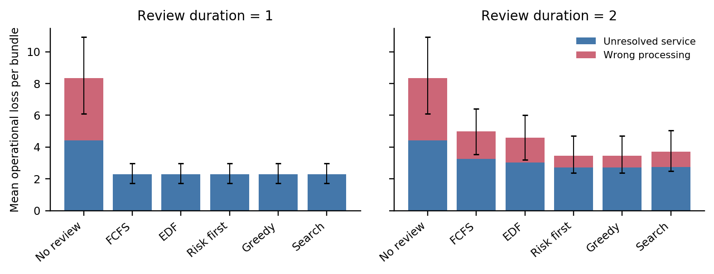
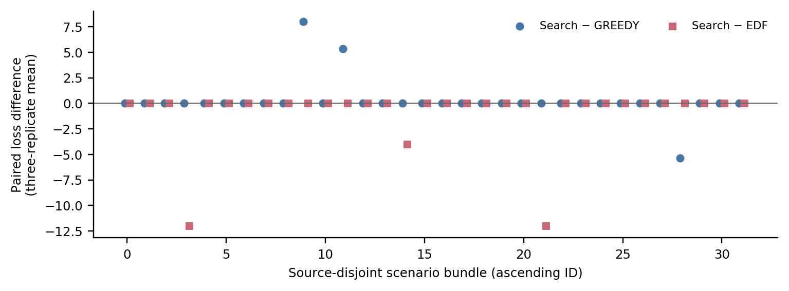
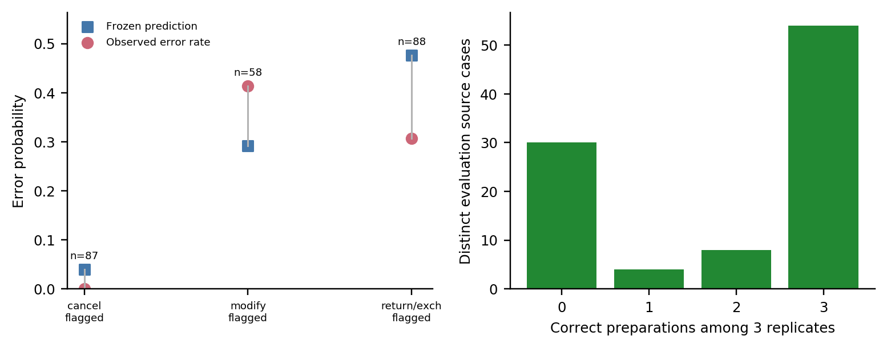

# Planning shared review for language model workflows with expiring intervention opportunities

Research narrative accompanying the compiled ICAART manuscript [main.pdf](main.pdf) and [supplement.pdf](supplement.pdf). The evidence combines frozen maintenance trajectories, an adapted retail transaction study and a separately frozen operational robustness study. Supervision is simulated throughout. Development chronology remains in the stage reports.

## Abstract

When several language-model agents share a reviewer, individually attractive interventions can compete with expiring opportunities. We study when planning review order improves outcomes, and how capacity, risk estimation and the chosen objective qualify that benefit. A frozen synthetic-maintenance evaluation uses fresh policy-specific GPU trajectories. At two-tick reviews, search minus greedy mean loss is −1.3125 (95% paired interval [−2.2500, −0.4375]) in a constructed competition workload, but −0.09375 [−0.5625, 0.34375] in the original workload. A public analytical risk reference improves prediction without consistently improving allocation outcomes, while optimizing correctness can raise the original weighted cost. An adapted τ-bench study then tests real multistep retail tool workflows with a shared transaction reviewer and constructed processing cutoffs. Across 32 source-disjoint bundles with three fresh preparation replicates, two-tick search minus greedy loss is +0.2500 [−0.3333, 1.0000]; all review policies tie at one tick, with failures before transaction staging setting the remaining loss floor. A fresh follow-up excludes all earlier retail accounts and evaluates 24 source cases in eight bundles. Under perfect approve-or-block authority, search has +1.6667 loss versus greedy [0.0000, 4.6667], with six bundle ties and two losses. The combined contribution is an executable formulation and paired empirical analysis that distinguishes scheduling gains from capacity, risk ranking, objective tradeoffs and corrective authority.

## 1. Scientific question

A shared reviewer faces two distinct decisions: which potential errors are worth correcting, and in what order corrections can still arrive in time. An accurate risk estimate need not improve scheduling if it does not change the relevant ranking. A different review order need not reduce realized loss. Lower weighted loss can also coexist with more incorrect outcomes when consequence weights differ.

We ask: **when does planning the order of a finite shared review queue improve outcomes over greedy allocation and earliest-deadline-first?** Secondary questions concern capacity, risk quality, generation variability and the objective being optimized. We examine these questions first in a transparent synthetic domain and then in a genuine local retail backend. The latter tests whether the mechanism survives multistep retrieval, policy interpretation and state-changing tool proposals.

Neither environment measures human review speed, attention, diagnostic accuracy or compliance. Review duration is a controlled abstract parameter; completed supervision is a perfect oracle in the reported experiments. All tasks are civilian and local.

## 2. Relation to prior work

τ-bench supplies interactive retail tasks, database tools, policies and final-state validation; its authors emphasize tool use, constraint following and reliability across trials [Yao et al., 2024]. We reuse this substrate but add transaction staging, processing cutoffs, consequence weights and a finite shared reviewer. Scripted customers and a restricted source-case subset change the benchmark, so our results are an **adapted benchmark study**, not an official τ-bench score.

KnowNo uses calibrated prediction sets to decide when a robot should request assistance [Ren et al., 2023]. Value of Information evaluates whether a clarification's expected utility exceeds its communication cost [Dong et al., 2026]. One Human, N Agents studies allocating a limited audit budget under miscalibrated and correlated confidence [Zavattari et al., 2026]. DeCCaF combines cost-sensitive deferral with capacity constraints [Alves et al., 2024]. These establish relevant help-seeking and allocation mechanisms; shared oversight and cost-aware deferral are not new claims here.

Our implemented FCFS, EDF, uncertainty-first and greedy baselines represent queue age, urgency, predicted risk and immediate expected benefit. They are **not implementations of those full research systems**. The application-specific distinction is finite-duration sequencing before explicit irreversible processing cutoffs, evaluated jointly with agent preparation errors. Classical scheduling already studies deadline and weighted-lateness objectives. Exhaustive current-queue enumeration is a transparent small-queue reference, not an algorithmic novelty claim.

The [verified related-work note](RELATED_WORK.md), [bibliography](references.bib) and [source/adaptation table](RETAIL_ADAPTATION.md) give primary links, inspected code and exact revisions. No author-linked released implementation for One Human, N Agents was located; that conceptual comparison is not presented as a reproduced code baseline.

## 3. Shared-review formulation

At tick t, the scheduler sees only released public requests: an arrival time, intervention cutoff, proposed action, declared consequences and an estimated probability of initial error. It cannot see realized hidden labels, unreleased jobs or future model outputs. One nonpreemptive reviewer requires s ticks per request. Only a completed review may reveal definitive diagnosis and correct an action; an already incurred consequence remains incurred.

Let G_i(T) be the preventable consequence if an incorrect request i is successfully reviewed at completion T. Delay-aware greedy selects the eligible request maximizing p_i G_i(t+s). EDF selects the earliest cutoff. Queue-order search enumerates ordered subsets of the currently eligible requests, maximizes the sum of p_i G_i(t+sum_{j<=k} s_j), dispatches the first request, and replans when free. It optimizes a declared current-queue expectation, not realized hidden errors or future arrivals. FCFS and uncertainty-first use arrival and p_i respectively. Shared deterministic tie rules are declared per experiment.

Two properties matter. First, an individually valuable request may consume the only slot in which another request can still be corrected. Second, expected benefit depends on both risk and the operational objective. We therefore define G separately for each application instead of transferring the maintenance formula into retail.

## 4. Synthetic maintenance study

### 4.1 Environment and frozen design

An agent sees two noisy clues about a binary ventilation fault, public costs and a repair manual. Independent clue accuracies are 0.8 and 0.6 given a uniform fault prior. Two fresh model samples are collected per job: the first repair executes and the second supplies agreement information. Incorrect repair incurs continuing downtime cost c_i and terminal incorrect-closure cost K_i. Episode loss is the sum of accrued downtime and terminal penalties; correct closures are reported separately. A completed correction at T prevents G_i(T) = I[T≤d_i] {c_i(d_i−T)+K_i}. Deadline equality can prevent terminal cost but does not erase prior downtime.

The original workload is compared with a deliberately constructed simultaneous-wave, terminal-penalty-only competition condition and a larger staggered workload. The latter has three or six agents, three jobs each and a 24-tick horizon. Public workload variables are independent of faults; matched per-agent streams preserve paired exogenous jobs across team sizes. Each policy, duration and risk condition receives fresh GPU generations and its own review-dependent agent history. This differs from the retail paired-proposal protocol below.

The frozen primary error estimate is the earlier agreement estimator. Alternatives are its pooled calibration probability and an analytical public-information reference that knows the synthetic clue likelihoods. The latter is not automatically available in deployment. It predicts first-action error probability 1/7 when following agreeing clues and 3/11 when following the stronger disagreeing clue, with complementary probabilities for opposite actions. No evaluation labels update any estimator.

The evaluation contains 2,752 episodes: 64 paired scenarios each for original and competition workloads, 32 for the larger workload, and a separately declared 16-scenario objective extension. Review durations are one and two ticks. The primary comparison is search minus greedy at two ticks, separately by original and competition distribution. Scenario-level bootstrap intervals use 2,000 fixed-seed resamples. Full matrices, development chronology, arithmetic audits and reproduction commands are retained in the [maintenance supplement](SUPPLEMENT_MAINTENANCE.md) and [Stage 4 report](../reports/STAGE4_RESEARCH.md).

### 4.2 Measured findings

| Workload | Review duration | Search mean loss | Greedy | EDF | Search − greedy, 95% paired interval |
|---|---:|---:|---:|---:|---|
| Original, 64 scenarios | 2 | 7.3281 | 7.4219 | 7.6563 | −0.0938 [−0.5625, 0.3438] |
| Constructed competition, 64 scenarios | 2 | 1.6875 | 3.0000 | 4.2500 | −1.3125 [−2.2500, −0.4375] |
| Constructed competition, 64 scenarios | 1 | 0 | 0.3750 | 0 | −0.3750 |
| Larger, six agents, 32 scenarios | 1 | 16.1875 | 22.3750 | 23.6875 | −6.1875 [−9.3758, −3.2813] |
| Larger, six agents, 32 scenarios | 2 | 36.5625 | 36.7813 | 46.0000 | −0.2188 [−2.3133, 1.9695] |

At two ticks in the original workload, search wins/ties/loses against greedy on 3/59/2 scenarios; in competition the counts are 15/42/7. Search versus EDF in two-tick competition is −2.5625 [−4.0000, −1.3125]. With one-tick competition reviews, search and EDF both achieve zero loss even though their sequences differ on 62/64 scenarios: different order is not itself evidence of improved realized outcomes.

Risk calibration is a limitation. The frozen estimator predicts roughly 0.149 error while observed errors are about 0.25–0.32 in the new trajectories. The analytical reference improves Brier scores, but corresponding fresh rollouts do not produce a consistent scheduling advantage. Prediction quality and allocation utility are distinct empirical questions.

The objective extension adds an incorrect-closure penalty λ to expected intervention benefit and eligibility. On the 16-scenario six-agent one-tick condition, λ=8 versus λ=0 raises original cost by 1.75 [0.1875, 3.4375] while reducing incorrect closures by 0.75 [0.375, 1.125] per scenario. The common augmented objective L+8U improves by 4.25 [1.000, 7.625]. At two ticks the gain weakens and the augmented objective is slightly worse. This is an objective tradeoff, not universal superiority.

All 3,056 development and evaluation traces replay, and 48,320 Stage 4 GPU requests are accounted for with zero retries or failed attempts. Identical-request variation is retained: 38 request groups among 7,276 repeated requests had mixed actions. Seeds do not promise bitwise regeneration. Search enumerates all 1,957 ordered subsets at queue size six; 22 observed six-request decisions averaged 4.531 ms (maximum 6.881 ms). These small measured costs do not establish scalability to large queues.

## 5. Adapted retail transaction study

### 5.1 Source cases and genuine agent work

We pin τ-bench at revision 59a200c6d575d595120f1cb70fea53cef0632f6b and retain its MIT-licensed tools, policies, task records and validator semantics. Three supported families cover cancellation, pending-order modification and delivered-order returns/exchanges. Agents authenticate, retrieve order and account data, inspect product variants, interpret policy, request confirmation and propose actual mutation-tool arguments. These are multistep database workflows, not renamed binary maintenance actions.

Source selection precedes model outcomes. Twenty-four development and 96 evaluation cases use 120 distinct customer accounts; all other variants for those accounts are excluded. Selection follows source order within supported families, with ambiguity and invalid annotated mutations excluded before inference. Evaluation is held out by source case/account, while broad workflow families and instruction templates remain shared. Public training-record exposure also prevents a claim of contamination-free evaluation.

The customer is scripted from the original task's operational information and confirms displayed proposals without independently auditing backend identifiers. Upstream inventory, order-status, item, payment and balance checks remain active. Additional target-blind guards require authentication, account ownership, prior retrieval, nonempty mutation arguments and confirmation of the exact proposal. These checks can still admit a transaction that targets an available but semantically wrong product variant. Final correctness uses upstream final-database equality; task success and policy/intent errors are reported separately.

### 5.2 Operational intervention and loss

A valid mutation is first staged without changing committed state. After agent preparation, three transactions enter a local simulated processing batch at public arrival slots 0/0/1. Independently permuted relative cutoff windows 2/4/5 represent order processing, modification locks and reverse-logistics handoff. Independently assigned wrong-transaction weights are 4/8/12 points. These are constructed processing conditions, not measured retailer deadlines or monetary costs.

A completed perfect review may replace the whole proposal with the annotated corrective transaction and commit it by cutoff. Otherwise the original transaction commits at cutoff. Completion at the cutoff is timely; later review cannot undo posting. Failed preparations have no review request and cannot be rescued by this intervention. Loss is four points for an unresolved service request plus the declared processing consequence if a wrong transaction commits. Thus G_i(T) = I[T≤cutoff_i] (4+w_i), with no maintenance downtime term.

Only the offline scorer and a completed simulated review access the private target. Scheduling receives public request features and a frozen application-specific risk. Reviewer approval is assumed sufficient to correct the transaction within the recorded customer intent; an additional customer conversation is not modeled. Upstream tool checks run again at commitment, while exact-argument confirmation is enforced during agent preparation. This corrective authority, perfect diagnosis and immediate compliance are idealizations, not measured human or customer behavior.

### 5.3 Development, risk and paired protocol

The tool interface and supported source cases are verified on development cases before freezing evaluation. Structured decoding chooses the tool before its arguments, and the agent observes explicit public workflow progress. Development revisions, failed pilots and all raw attempts remain in the [Stage 5 report](../reports/STAGE5_PRACTICAL.md); they are not part of the held-out policy comparison.

Calibration uses 72 development workflows with 64 staged proposals and 15 initial errors. Every staged proposal receives a pre-review label regardless of review selection. The public risk features are workflow family and a flag for non-high confidence or an earlier automatic rejection. Laplace-smoothed bins with fewer than ten examples fall back to the pooled calibration estimate. All staged calibration proposals are flagged, so the rule effectively separates families: cancellation 0.04, modification 0.2917 and return/exchange 0.4762; sparse fallback is 0.2424. This estimator is frozen before evaluation and does not reuse maintenance probabilities.

The evaluation declares 32 source-disjoint bundles, three source cases each and three fresh generation replicates. The 288 live GPU workflows are prepared with separate agent histories. All six review policies and both capacities then receive the **same saved transactions**. No model generation follows staging, so deterministic paired policy replay exactly represents this transaction-boundary intervention. It does not measure how later agent behavior responds to feedback. The six policies are no review, FCFS, EDF, uncertainty-first, greedy and search. One parallel-perfect-review reference additionally bounds what correction of staged proposals could achieve.

The primary comparison is search minus greedy at two-tick reviews. One-tick capacity and other policy comparisons are secondary. Replicates are averaged within bundle; all conditions for a bundle are resampled together in 2,000 bootstrap draws with seed 20260915. The 1,152 policy replay rows are not independent scenarios. Intervals describe variation across these selected source bundles, not a random sample of real retailer traffic. Task selection, settings, risk, processing weights, execution order, sample sizes and analysis definitions were committed before the first evaluation generation.

### 5.4 Measured retail results

All 288 declared preparation attempts finish: 233 stage a transaction, 182 are initially correct, 51 stage a wrong valid transaction and 55 never stage. Every one of the 1,152 paired policy traces replays. No scenario or failure is replaced.

| Policy | Mean loss, 1 tick | Mean loss, 2 ticks | Correct tasks, 2 ticks / 288 | Wrong commits, 2 ticks |
|---|---:|---:|---:|---:|
| No review | 8.3333 | 8.3333 | 182 | 51 |
| FCFS | 2.2917 | 5.0000 | 210 | 23 |
| EDF | 2.2917 | 4.5833 | 215 | 18 |
| Uncertainty-first | 2.2917 | 3.4583 | 223 | 10 |
| Delay-aware greedy | 2.2917 | 3.4583 | 223 | 10 |
| Queue-order search | 2.2917 | 3.7083 | 222 | 11 |

The primary two-tick comparison is **search − greedy = +0.2500 points**, 95% paired interval **[−0.3333, 1.0000]**, with **1 win, 29 ties and 2 losses** across 32 bundle means. Search performs 190 completed reviews versus greedy's 169, yet makes 40 corrections versus 41. This unfavorable point estimate does not establish a population disadvantage, but provides no evidence of a search advantage. Search versus EDF is −0.8750 [−2.0000, 0], with three wins and 29 ties, a secondary comparison. Uncertainty-first has the same aggregate outcomes as greedy.

At one tick, all policies with review correct every queued initial error and match the parallel-perfect-review reference: loss 220, mean 2.2917 and 233/288 correct. The entire remaining loss is 55 unstaged failures × four points. Greedy and uncertainty-first review 224 proposals while FCFS, EDF and search review 233; nine unreviewed proposals are initially correct. Thus different review orders and counts need not change realized outcomes.

There is public queue contention, but useful contention is limited. On search's states, greedy and search choose different heads at 47/103 competitive two-tick dispatches. Their actual sequences differ on 47/96 two-tick runs; search versus EDF differs on 23/96. Only four of search's two-tick dispatches have two initially wrong eligible requests, measured retrospectively with labels unavailable to the scheduler. An exact-rational public-state audit finds no head-value regret or canonical-tie error in 6,372 dispatch records.

The estimator improves aggregate Brier score over pooled calibration risk (0.15585 versus 0.17153; constant 0.5 gives 0.25), with AUROC 0.7096. However, all staged proposals are flagged, and family ranking is imperfect: modification error is 24/58=0.4138 versus predicted 0.2917; return/exchange error is 27/88=0.3068 versus predicted 0.4762. Cancellation has no errors among 87 staged proposals. Returns and exchanges differ further (6/48 versus 21/40 staged errors). No evaluation labels update the estimator.

Automatic checks block 778 calls, including 338 attempted mutations. Fifty-five preparations remain unresolved: 50 exhaust the 14-call limit, four explicitly finish without staging, and one exhausts a generation retry. Modification accounts for 38 failures. Wrong valid transactions include incorrect available variants and omitted requested items; these task-intent errors are separate from automatically blocked calls and are not a complete natural-language compliance taxonomy. Three generation replicates yield different proposals/staging outcomes on 25/96 source cases and variable task success on 12/96.

The predeclared first positive example, evaluation_28_r0, shows search/EDF correcting a laptop modification at its tick-2 cutoff before fixing a puzzle exchange; greedy lets the laptop mistake post and loses eight points. The first unfavorable example, evaluation_09_r0, shows search protecting an urgent correct cancellation before an incomplete return, while a later-released wrong wall-clock modification expires. Greedy fixes both errors and loses zero versus search's 12. The first tie, evaluation_00_r0, has different orders but the same missed late-arriving bookshelf exchange. These are actual tool outputs and simulated irreversible consequences, not mechanics fixtures.

*Retail mean loss components with bundle-bootstrap intervals. The inferential comparison is paired, not based on overlap of marginal intervals.*

*Two-tick paired differences after averaging the three generation replicates within each source-disjoint bundle.*

*Frozen family risk versus observed staged errors, and source-case preparation success across three replicates.*

Stage 5 accounts for 3,313 GPU attempts across 3,311 calls, including development, with three truncated attempts and two retries. Evaluation uses 2,453 attempts and 11,837,012 prompt / 197,346 completion tokens. Largest input is 11,883 tokens; the declared 512-token output limit causes the retained failures. Actual two-request search dispatches examine five subsets and average 0.05135 ms on the local i5-10400 host. These small-queue timings do not establish scalability. Full resource accounting, public redaction provenance and readable traces are in the [Stage 5 report](../reports/STAGE5_PRACTICAL.md).

## 6. Operational robustness

### 6.1 Methodological review and intervention authority

The [retail assumption review](RETAIL_ASSUMPTION_REVIEW.md) checks the actual adapter, pinned upstream tools/policy and primary platform documentation. Staging is a coherent intervention gate when a service controls tool dispatch, but it is an added architecture rather than native benchmark behavior. Return and exchange tools create requests, not completed physical fulfillment. The common abstract cutoffs and consequence points are experimental quantities, not observed retailer lead times or prices. Correcting the entire confirmed transaction without another customer conversation is stronger than approval. Exact state equality can also be stricter than operational task equivalence. The review is source-based, not independent human expert validation.

We retain the original correction condition at one- and two-tick base capacity and add two one-factor changes. The restricted reviewer perfectly detects correctness only at completed review. It approves the original correct proposal unchanged or blocks a wrong proposal, leaving the account unchanged and the request unresolved. Blocking has no task-completion or correction credit. With service cost four and posting consequence W, correction prevents 4+W but blocking prevents only W. Scheduling therefore uses pW under restricted authority. This is not a common rescaling when W varies.

The separate complexity condition retains correction authority and adds one tick if the public proposal lists at least two items. This is a declared burden proxy, not a fitted human-time model. A wrong omission can make the proposal appear simpler. Prompts, preparation, estimator, arrivals, cutoffs and weights are unchanged. There is no authority-by-complexity interaction study.

### 6.2 Fresh source audit and fixed design

The audit inspects all 635 upstream source records across train, dev and test. It excludes every account used anywhere in Stage 5, including pilots and development, and identifies 54 accounts duplicated across source splits. Before cross-family reservation there are ten unused eligible modification accounts, 26 cancellation accounts and 69 return/exchange accounts. The 16-bundle target is infeasible. The frozen fallback uses eight globally disjoint bundles, each with three distinct training cases and three fresh generation replicates. Source order and annotated-transaction checks determine inclusion before model outputs. Broad templates remain shared and public-data training exposure is not ruled out.

All 72 workflows supply the same prepared inputs to six policies, both capacities and all three operational variants, producing 864 policy episodes. The primary contrast is search minus greedy loss under approve/block at base duration two. Replicates are averaged within bundle before 2,000 paired bootstrap draws with seed 20260916. All matched conditions share bootstrap indices. The 32 earlier bundles form a separate post hoc sensitivity cohort, not a larger pooled fresh sample. Source IDs, code, prompts, risk, analysis and stopping rules were committed before inference.

### 6.3 Fresh findings and mechanism

The fresh study retains 51 staged transactions, including 12 initial errors, and 21 unstaged failures from 72 workflows. The primary search-minus-greedy difference is **+1.6667 [0.0000, 4.6667]**, with W/T/L **0/6/2**. The eight bundle differences are 0, 0, 0, 0, 0, 0, 1.3333 and 12.0000. Search has mean loss 7.1667 versus greedy 5.5000 and EDF 7.0000. It blocks eight wrong transactions versus greedy's twelve, leaving four wrong commits. Both complete 39 initially correct tasks under restricted authority. The wide interval and sparse eight-bundle sample do not establish equivalence or a general population disadvantage.

| Policy | Correction, base 2 | Approve/block, base 2 | Complexity time, base 2 |
|---|---:|---:|---:|
| No review | 9.8333 | 9.8333 | 9.8333 |
| FCFS | 5.5000 | 7.0000 | 5.8333 |
| EDF | 5.5000 | 7.0000 | 5.8333 |
| Uncertainty-first | 3.5000 | 5.5000 | 3.8333 |
| Greedy | 3.5000 | 5.5000 | 3.8333 |
| Search | 5.8333 | 7.1667 | 6.1667 |

At base one, every review policy prevents all staged errors under each variant. Correction and complexity time reach the unstaged-failure floor of 84 total points. Approve/block retains unresolved service for all 33 initially unsuccessful tasks, totaling 132. These different completion floors follow mechanically from authority. No-review outcomes are invariant by definition.

Every fresh approve/block sequence matches its reference correction sequence. Its smaller search-versus-greedy loss difference therefore reflects a changed consequence function rather than better allocation. Only six staged proposals from four cases receive an extra complexity tick, including two initial errors. At base two, complexity adds one third of a point to both search and greedy mean loss and leaves their +2.3333 paired difference unchanged. Limited exposure qualifies this sensitivity finding.

Search and greedy sequences differ in six of 24 fresh two-tick runs, versus one search/EDF difference. Search sees 19 competitive dispatches and disagrees with greedy on six heads. In the first unfavorable trace, bundle 06 replicate 2, search protects a correct urgent cancellation, then reviews a correct exchange that arrived later. The initially wrong modification reaches its cutoff. Greedy blocks that modification first, incurring four unresolved-service points rather than search's eight points including posting cost. This result connects the current-queue planning rule, later arrivals outside the visible state, and error ranking. There is no fresh positive example under the declared primary selection rule.

Aggregate Brier score is 0.17144 versus 0.17998 for pooled calibration risk, with AUROC 0.6581. However, modification errors are 8/13 and return/exchange errors 4/18, opposite the frozen family-risk ranking. All 20 staged cancellations are correct. Eight cases have different proposals across generation replicates and four have mixed initial correctness. These are different seeded requests and histories, not a repeated-identical-request diagnostic. The 18 step-limit failures and three finishes without staging remain outside transaction review. No evaluation labels change the estimator.

### 6.4 Separate saved-preparation sensitivity

All 1,152 original Stage 5 reference traces match exactly. The declared variants produce 3,456 total post hoc traces on the same 288 preparations. Restricted-authority search minus greedy at base two is +0.1250 [-0.1667, 0.5000], W/T/L 1/29/2. Complexity time yields +0.5000 [-0.0833, 1.2500], W/T/L 1/28/3. These do not replace Stage 5's original +0.2500 [-0.3333, 1.0000] primary result. Only two of 96 restricted-authority search sequences change relative to correction. The first saved-data benefit, evaluation_28_r0, remains reported alongside the fresh tie, unfavorable and preparation-failure traces.

## 7. Interpretation across applications

The maintenance evidence supports a conditional scheduling benefit: search helps in a constructed deadline competition setting, shows no clear gain in the original workload, and can trade correctness for weighted cost. At sufficient capacity, EDF may preserve every useful opportunity despite a different sequence. Better-calibrated public probabilities do not necessarily change the actions that determine realized loss.

The retail extension does not reproduce a search-over-greedy gain. It supplies a practical boundary condition: valid multistep preparation, the accuracy of risk ranking, arrivals outside the visible queue and the reviewer's corrective authority all matter. At sufficient capacity, simple policies correct every queued error; at constrained capacity, extra reviews can protect already correct transactions while other errors expire. The source-case sample and perfect-review assumption limit generalization. This negative primary result is compatible with the positive constructed-maintenance result because the workloads, error processes and intervention boundaries differ.

The two protocols answer related but different questions. Maintenance compares integrated fresh policy trajectories, including review-dependent histories and generation differences. Retail compares policies on identical prepared transactions, isolating review allocation but ending the agent workflow at the intervention boundary. Neither should be described as evidence for the other's unmeasured feedback effects.

## 8. Limitations and submission requirements

The reviewer is perfect and simulated; costs and time units are chosen experimental quantities. Review duration uses controlled base values and a simple public complexity proxy rather than measured labor times; monetary review labor costs are not included. Retail source-case selection is bounded, broad templates are shared, the scripted customer can miss semantic errors, and upstream public training records may have appeared in model training. Annotated final-state equality can be stricter than operational equivalence: a wrong reason or refund destination may fail a task even when the intended order status changes. The declared loss weights do not establish the monetary severity of these different error classes. Transaction staging assumes a service architecture that can delay commitment; it does not cover already dispatched irreversible operations. The small application risk estimator may not generalize, and no evaluation labels are used to improve it.

All inference uses pinned Qwen2.5-7B-Instruct BF16 on an RTX 6000 Ada with zero CPU model offloading. This controls one model/runtime configuration, not model-family robustness. Ordinary host orchestration and local simulation remain on CPU. Fresh generation variability, prompt changes caused by histories, and deterministic saved-output replay are distinct. Repeated trials improve measurement of a source case without creating new independent cases.

A defensible paper contribution is the transparent operationalization and measurement of shared review under expiring intervention opportunities, with explicit comparisons of capacity, risk, objectives and application boundaries. It is not new shared oversight, cost-aware deferral, exhaustive scheduling, general alignment, or measured human performance. The focused fresh robustness study and official-template manuscript are complete. Independent domain-expert validation remains absent. Before submission, human authors must review the interpretation and finalize authorship and declarations, confirm AI-disclosure placement, and establish whether the venue accepts a regular-paper supplement. The main manuscript contains the essential methods and unfavorable results even if the local supplement is not uploaded.

## Evidence and reproducibility

[CLAIM_EVIDENCE.md](CLAIM_EVIDENCE.md) maps claims to exact artifacts. [CORE_METHOD.md](CORE_METHOD.md) defines implementation semantics. Stage reports contain clocks, GPU evidence, source snapshots, raw responses, manifests, failures, deterministic replay audits and exact commands. A disclosed publication redaction removes unsolicited credential-like model text from public auxiliary arguments and prompt histories; exact originals and their hashes remain available on the pod. It changes no staged transaction, state, label or score. Saved-data analysis does not require new inference. Historical outputs remain preserved; reproducing fresh GPU trajectories requires a new explicit authorization and must not overwrite frozen runs.

The [Stage 6 reproduction guide](STAGE6_REPRODUCTION.md) provides a clean-checkout saved-output path. [Venue requirements](ICAART_REQUIREMENTS.md) and [verified references](references.bib) accompany the official template. All new GPU calls, failures, clocks and cumulative totals are recorded in [STAGE6_ROBUSTNESS.md](../reports/STAGE6_ROBUSTNESS.md).
