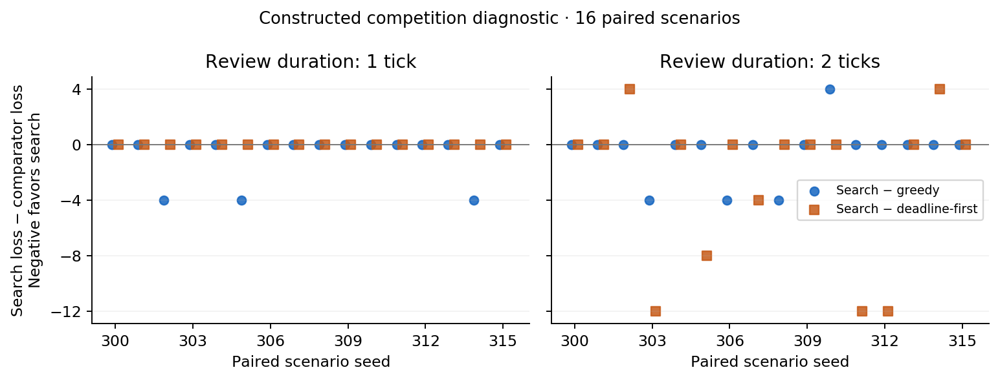

# Stage 3: constructed competition for simulated supervision

**Completed: 192 episodes, 2,305 GPU generations including placement, zero failures, and 192 verified replays.** Search versus greedy total loss was **0 versus 12** at one tick and **44 versus 52** at two ticks. Search tied EDF at one tick and totaled **44 versus 84** at two ticks, with individual negative outcomes retained.

This stage investigates whether queue-order search reduces realized missed-deadline loss when useful review requests arrive together, and how the comparison changes with review duration. It is a deliberately constructed **development diagnostic**, motivated by Stage 2's limited competition, identical greedy/search orders, and slightly lower FCFS loss. It does not replace those negative Stage 2 findings or constitute held-out evaluation.

## Authorization and predeclaration

Baseline: `c6871facdae9d0ebff0aa74dbe9a443ba6ff00c1` on `main`. The user authorized a separate two-hour continuation starting **2026-09-10 02:47:37 UTC**, with deadline **04:47:37 UTC**. Historical clocks and historical command deadlines remain intact. The unchanged original 36-hour window is **2026-09-09 15:38:57 through 2026-09-11 03:38:57 UTC**. [Authorization](../artifacts/stage3_competition/continuation_clock.json), [cumulative clock](implementation_clock.json).

The declaration was saved at **02:58:14.895413 UTC**, before GPU generation. Its SHA-256 identity is `60ca9324f7b12f0b1e2dd8dad8d87a6a439b25053b4b969569f91bc93d983f8a`. It fixes the generator, 16 seeds and full scenario hashes, estimator hash, source/configuration/prompt hashes, execution order, budgets, and analysis definitions. [Declaration](../artifacts/stage3_competition/run/declaration.json), [source snapshot](../artifacts/stage3_competition/run/source/), [scorer-only scenarios](../artifacts/stage3_competition/run/scenarios.scorer-only.json).

Exactly seeds **300–315**, six policies, and review durations **one and two ticks** produce **192 episodes**, **1,152 job pairs**, and **2,304 scheduled experimental calls**. The experiment permits at most one retry per call (4,608 experimental attempt ceiling), with the existing 60-second shared tokenization/inference timeout, and at most **one separate placement generation with one attempt**. No seeds were selected by errors or outcomes. The original generator, costs, prompts, configurations, and Stage 2 estimator were preserved.

For scenario index `i=seed−300`, duration order is `[1,2]` when `i` is even and `[2,1]` when odd, so each duration runs first eight times. At duration position `j`, policy order left-rotates `[fcfs, uncertainty, myopic, greedy, edf, delay]` by `(2i+j) mod 6`. Each run gets fresh calls and separate histories. Request seeds retain the existing hash of scenario/agent/job/sample/retry, excluding policy, duration, and execution order. Different feedback can change later prompts despite matched seeds.

## Controlled condition and estimator

Three agents each receive one job at tick 0 and one at tick 6, within the unchanged 12-tick horizon. In each wave, deadline windows `{2,4,5}` and terminal penalties `{4,8,12}` are assigned by independent random permutations. Downtime cost is **zero**, so loss is the sum of terminal penalties for jobs still wrong at closure; episode loss lies in `[0,48]`.

The equal filter/sensor prior and independent clue accuracies **0.8 and 0.6** are unchanged. Distinct deterministic random streams for deadline permutations, penalty permutations, and faults/clues make assignments independent of hidden correctness. Agents are exchangeable under the permutation rule; the small realized batch is not forced to have identical assignment counts. Every scenario has the same jobs, faults, clues, deadlines, and penalties across all twelve policy/duration conditions.

The Stage 2 estimator file is copied byte-for-byte and checked before execution and each episode. Estimator hash: `54d9a97e25f5cb22cf0df216293303ea5c945713032c6bc1282c55fcf327e085`; file SHA-256: `4ce8309bce27b70cdab1bd707bc3468f1039e88d4c30632541231efd6dde0d9d`. Agreeing pairs retain **13/89 = 0.1460674157**; disagreeing pairs retain **18/98 = 0.1836734694**, the original pooled fallback for a bin with fewer than ten calibration examples. There is **no additional calibration or refitting**. [Frozen copy](../artifacts/stage3_competition/run/estimator.json).

Earliest-deadline-first (`edf`) chooses the eligible request with the earliest absolute deadline, followed by request-time/agent-ID/job-ID ties. The original positive-benefit eligibility guard and queue-order search are unchanged. With zero downtime, both myopic and greedy rank eligible requests by `p×terminal_penalty`; they are mathematically equivalent on an identical public state. Policy lists are scoped separately for the historical four-policy, five-policy, and new six-policy experiments.

Only the first model sample executes. The second supplies agreement information. Hidden labels are used only for offline diagnostics, scoring, and completed simulated supervision. Schedulers see released public requests, never faults or future jobs. Completed reviews apply before deadline closure, so equality is timely. Inference latency does not advance simulated ticks.

## Reused GPU runtime

Authenticated SSH reused the pod at **38.80.152.248:33513**, hostname `efbc29db9f5f`, and checkout `/workspace/OverseeingManyLLMs-rtx6000-ada-20260910T002404Z`. The existing environment, cached model, API server PID **7338**, and engine PID **8449** were retained without installing or restarting anything. Hardware: **NVIDIA RTX 6000 Ada Generation, 49,140 MiB**, driver **580.126.20**. Preflight free space was approximately **66 GB root / 47 GB workspace**. [Preflight](../artifacts/stage3_competition/runtime_preflight.txt).

Actual Python **3.11.13**, PyTorch **2.8.0+cu128** / CUDA runtime **12.8**, vLLM **0.10.2**, and Transformers **4.55.2** were checked; the driver compatibility version was not substituted for the installed runtime. Model/tokenizer: **Qwen/Qwen2.5-7B-Instruct**, revision **`a09a35458c702b33eeacc393d103063234e8bc28`**. BF16, one GPU, tensor parallelism 1, eager mode, one sequence, length 2048, memory reservation 0.5, CPU offload **0**, swap **0**, and loopback port 8000 remain fixed. Decoding retains temperature .3, top-p 1, strict JSON actions, 1,024 input and 48 output token limits. [Resolved versions](../artifacts/stage3_competition/run/requirements.actual.txt).

The GPU gate records actual BF16 CUDA matrix multiplication, model/tokenizer identity, server flags, CUDA/BF16 load evidence, and resident serving-process memory [before](../artifacts/stage3_competition/run/gpu_before.json), [after placement](../artifacts/stage3_competition/run/gpu_after_placement.json), and [after the batch](../artifacts/stage3_competition/run/gpu_final.json). All model inference executed on GPU. Host orchestration, tokenization, simulation, scoring, analysis, and replay are separate from model inference. [Placement raw request/response](../artifacts/stage3_competition/run/placement_raw_requests.jsonl), [stage server log](../artifacts/stage3_competition/server_stage3.log).


## Completion and measured outcomes

**All 192/192 episodes completed and all 192 completed traces replayed successfully on the pod and after transfer.** There were **2,304 experimental generations plus one placement generation**, **zero retries**, **zero failed attempts**, and **zero unknown token counts**. No episode or seed was replaced, rerun, dropped, or added. [Execution manifest](../artifacts/stage3_competition/run/manifest.json), [episode CSV](../artifacts/stage3_competition/run/episodes.csv), [pod audit](../artifacts/stage3_competition/pod_verification.json), [local audit](../artifacts/stage3_competition/local_verification.json).

Each table aggregates **16 paired scenarios** per policy, with 96 jobs. “Expired useful” means a request with positive preventable consequence at arrival that expired unserved (`opportunity_lost_while_waiting`); this uses the existing definition, not knowledge of whether its action was actually wrong. The adjacent “wrong expired” column uses offline truth to count initial wrong actions among those missed opportunities. All expired requests here fall in that useful-opportunity category. There were no late review returns or incomplete episodes.


### Review duration: 1 tick


| Policy | Total loss | Mean loss | Correct jobs | Completed reviews | Corrections | Expired useful | Wrong expired |
| --- | ---: | ---: | ---: | ---: | ---: | ---: | ---: |
| FCFS | 28 | 1.75 | 92/96 | 85 | 22 | 11 | 4 |
| Uncertainty-first | 28 | 1.75 | 92/96 | 86 | 22 | 10 | 4 |
| Myopic benefit | 12 | 0.75 | 93/96 | 89 | 23 | 7 | 3 |
| Delay-aware greedy | 12 | 0.75 | 93/96 | 89 | 24 | 7 | 3 |
| Earliest-deadline-first | 0 | 0.00 | 96/96 | 96 | 27 | 0 | 0 |
| Queue-order search | 0 | 0.00 | 96/96 | 96 | 26 | 0 | 0 |


### Review duration: 2 ticks


| Policy | Total loss | Mean loss | Correct jobs | Completed reviews | Corrections | Expired useful | Wrong expired |
| --- | ---: | ---: | ---: | ---: | ---: | ---: | ---: |
| FCFS | 52 | 3.25 | 88/96 | 64 | 18 | 32 | 8 |
| Uncertainty-first | 56 | 3.50 | 88/96 | 64 | 18 | 32 | 8 |
| Myopic benefit | 52 | 3.25 | 88/96 | 64 | 18 | 32 | 8 |
| Delay-aware greedy | 52 | 3.25 | 88/96 | 64 | 18 | 32 | 8 |
| Earliest-deadline-first | 84 | 5.25 | 85/96 | 64 | 15 | 32 | 11 |
| Queue-order search | 44 | 2.75 | 85/96 | 64 | 15 | 32 | 11 |


At **one tick**, search and EDF review every job before its deadline, giving zero loss under perfect simulated diagnosis. Search's 12-unit advantage over greedy comes from three scenarios, while all 16 search/EDF loss comparisons tie. At **two ticks**, capacity permits two reviews per three-job wave: every policy completes 64 reviews and misses 32 opportunities. Search has lower aggregate weighted loss, **44 versus greedy's 52 and EDF's 84**, but it does **not** reduce the number of missed opportunities. It closes only 85/96 jobs correctly versus greedy's 88/96: lower weighted loss here trades off against the number of correct jobs.

In this constructed two-tick condition, search leaves all 32 unreviewed jobs with terminal penalty 4. Eleven are initially wrong, producing loss `11×4=44`. Given the narrow frozen probability range and penalties 4/8/12, its estimated-value ranking preserves the two higher-penalty jobs in each wave and orders them to meet deadlines. This is an interpretable consequence of the controlled cost/deadline design, not evidence of general scheduling sophistication or novelty.

## Paired scenario comparisons

Differences below are **search loss minus comparator loss**; negative favors search. Wins/ties/losses refer to search on the same scenario and review duration. All comparisons have 16 completed pairs. The 192 episodes are repeated conditions on **16 scenarios**, not 192 independent observations. No final effectiveness claim, confidence interval, or significance test is inferred from this diagnostic batch.

| Review ticks | Comparator | Total difference | Mean paired difference | Search wins / ties / losses | Different actual review sequences |
| ---: | --- | ---: | ---: | --- | ---: |
| 1 | FCFS | -28 | -1.75 | 4 / 12 / 0 | 11/16 |
| 1 | Uncertainty-first | -28 | -1.75 | 4 / 12 / 0 | 13/16 |
| 1 | Myopic benefit | -12 | -0.75 | 3 / 13 / 0 | 15/16 |
| 1 | Delay-aware greedy | -12 | -0.75 | 3 / 13 / 0 | 15/16 |
| 1 | Earliest-deadline-first | +0 | +0.00 | 0 / 16 / 0 | 16/16 |
| 2 | FCFS | -8 | -0.50 | 3 / 10 / 3 | 15/16 |
| 2 | Uncertainty-first | -12 | -0.75 | 4 / 9 / 3 | 15/16 |
| 2 | Myopic benefit | -8 | -0.50 | 3 / 12 / 1 | 14/16 |
| 2 | Delay-aware greedy | -8 | -0.50 | 3 / 12 / 1 | 14/16 |
| 2 | Earliest-deadline-first | -40 | -2.50 | 5 / 9 / 2 | 11/16 |


All policy-pair rows are retained in [paired scenario differences](../artifacts/stage3_competition/run/paired_scenario_differences.csv) and [paired summaries](../artifacts/stage3_competition/run/paired_comparisons.csv). In particular, search loses to greedy on one two-tick scenario and to EDF on two; those negative outcomes remain in the tables and figure.

| Seed | One tick: search − greedy | One tick: search − EDF | Two ticks: search − greedy | Two ticks: search − EDF |
| ---: | ---: | ---: | ---: | ---: |
| 300 | 0 | 0 | 0 | 0 |
| 301 | 0 | 0 | 0 | 0 |
| 302 | -4 | 0 | 0 | 4 |
| 303 | 0 | 0 | -4 | -12 |
| 304 | 0 | 0 | 0 | 0 |
| 305 | -4 | 0 | 0 | -8 |
| 306 | 0 | 0 | -4 | 0 |
| 307 | 0 | 0 | 0 | -4 |
| 308 | 0 | 0 | -4 | 0 |
| 309 | 0 | 0 | 0 | 0 |
| 310 | 0 | 0 | 4 | 0 |
| 311 | 0 | 0 | 0 | -12 |
| 312 | 0 | 0 | 0 | -12 |
| 313 | 0 | 0 | 0 | 0 |
| 314 | -4 | 0 | 0 | 4 |
| 315 | 0 | 0 | 0 | 0 |




[Vector figure](../artifacts/stage3_competition/run/paired_loss.svg). Each point is one paired scenario difference. Negative values favor search; coincident zeros remain plotted rather than removed.

## Does planning change decisions?

A dispatch opportunity is a free-supervisor decision with at least one eligible request; a competitive dispatch has at least two. The saved public state is also evaluated offline with all six rules to compare decisions on **identical information**. This produces alternative first choices only, not counterfactual rollouts or model generations.

| Review ticks | Observed policy trajectory | Dispatch opportunities | At least two eligible | Same-state search ≠ greedy | Same-state search ≠ EDF |
| ---: | --- | ---: | ---: | ---: | ---: |
| 1 | FCFS | 85 | 64 | 35 | 23 |
| 1 | Uncertainty-first | 86 | 64 | 35 | 24 |
| 1 | Myopic benefit | 89 | 64 | 31 | 21 |
| 1 | Delay-aware greedy | 89 | 64 | 31 | 21 |
| 1 | Earliest-deadline-first | 96 | 64 | 35 | 34 |
| 1 | Queue-order search | 96 | 64 | 35 | 25 |
| 2 | FCFS | 64 | 42 | 22 | 9 |
| 2 | Uncertainty-first | 64 | 43 | 22 | 9 |
| 2 | Myopic benefit | 64 | 39 | 22 | 9 |
| 2 | Delay-aware greedy | 64 | 39 | 22 | 9 |
| 2 | Earliest-deadline-first | 64 | 64 | 22 | 19 |
| 2 | Queue-order search | 64 | 57 | 22 | 16 |


Thus greedy/search differ on **202/384** logged competitive states at one tick and **132/284** at two ticks, pooled over trajectories for descriptive counting only. Those repeated states are not independent observations. Every scenario now contains simultaneous eligible competition, unlike Stage 2's three of eight scenarios. Actual greedy/search sequences differ in **15/16 scenarios at one tick** and **14/16 at two ticks**; search/EDF sequences differ in **16/16** and **11/16**, respectively. Different order is much more common than different realized loss. [Dispatch states/choices](../artifacts/stage3_competition/run/dispatch_opportunities.csv), [actual orders](../artifacts/stage3_competition/run/review_orders.csv), [sequence comparisons](../artifacts/stage3_competition/run/sequence_comparisons.csv).

Myopic and greedy choose identically on **all 1,920 saved dispatch states**, as expected for zero downtime under the common eligibility guard. They also have identical actual review sequences and losses in all **32 scenario/duration pairs**. Fresh model outcomes need not be identical; a correction-count difference at one tick is documented under reproducibility below.

### Predeclared queue example: seed 300, one-tick reviews

This is the first numerical seed with different greedy/search sequences; duration one wins the predeclared duration tie-break. It was selected **without considering which policy wins**, and in fact both losses are **zero**.

At tick 0, the three requests have `(deadline, penalty)` values `a0j0=(4,8)`, `a1j0=(2,12)`, and `a2j0=(5,4)`, all with agreeing samples and `p=13/89`. Greedy starts `a1j0 → a0j0 → a2j0`; search starts `a0j0 → a1j0 → a2j0`. Both finish all three on time. The first action for `a0j0` was wrong and is corrected at tick 2 by greedy, at tick 1 by search; zero downtime makes that timing difference costless. The second-wave orders match. This example demonstrates a changed order **without a realized loss reduction**. [Readable example](../artifacts/stage3_competition/run/queue_example.md), [full queue timeline](../artifacts/stage3_competition/run/queue_timeline.md).

## Frozen-estimator behavior on the changed workload

Each policy/duration has 96 successfully collected pairs. Labels are the first action's correctness **before any correction**, regardless of review status. Bin diagnostics use each run's observed trajectories and never change the frozen estimator.

| Review ticks | Policy | Agree: errors / pairs | Disagree: errors / pairs | Initial error rate | Frozen Brier |
| ---: | --- | --- | --- | ---: | ---: |
| 1 | FCFS | 23/91 | 3/5 | 0.270833 | 0.211345 |
| 1 | Uncertainty-first | 23/91 | 3/5 | 0.270833 | 0.211345 |
| 1 | Myopic benefit | 23/91 | 3/5 | 0.270833 | 0.211345 |
| 1 | Delay-aware greedy | 24/92 | 3/4 | 0.281250 | 0.218589 |
| 1 | Earliest-deadline-first | 24/92 | 3/4 | 0.281250 | 0.218589 |
| 1 | Queue-order search | 23/92 | 3/4 | 0.270833 | 0.211215 |
| 2 | FCFS | 23/90 | 3/6 | 0.270833 | 0.211474 |
| 2 | Uncertainty-first | 23/90 | 3/6 | 0.270833 | 0.211474 |
| 2 | Myopic benefit | 24/93 | 2/3 | 0.270833 | 0.211870 |
| 2 | Delay-aware greedy | 24/93 | 2/3 | 0.270833 | 0.211870 |
| 2 | Earliest-deadline-first | 23/93 | 3/3 | 0.270833 | 0.211086 |
| 2 | Queue-order search | 23/91 | 3/5 | 0.270833 | 0.211345 |


The frozen probabilities substantially underpredict this batch's observed initial error rates: roughly 25–26% in agreement bins versus the frozen 14.6%, and 50–100% in tiny disagreement bins versus 18.4%. Disagreement counts are only 3–6 per policy/duration, so their observed rates are unstable. Overall Brier scores are approximately 0.211–0.219. This is a distribution-shift diagnostic, not new calibration evidence used for fitting. Exact bin-specific Brier scores and every labeled pair are saved in [prediction diagnostics](../artifacts/stage3_competition/run/prediction_diagnostics.csv) and [initial predictions](../artifacts/stage3_competition/run/initial_predictions.csv). Policy runs are repeated observations on the same scenarios and must not be pooled as independent error examples for an effectiveness claim.

## Calls, tokens, time, and final server status

| Work | Scheduled calls | Attempts | Retries / failures | Prompt tokens | Completion tokens |
| --- | ---: | ---: | --- | ---: | ---: |
| Experimental matrix | 2,304 | 2,304 | 0 / 0 | 497,544 | 16,176 |
| Placement | 1 | 1 | 0 / 0 | 195 | 7 |
| **Total** | **2,305** | **2,305** | **0 / 0** | **497,739** | **16,183** |

The actual launch spans **02:58:37.327525–03:06:27.076504 UTC**, **469.748979 seconds**, including final GPU checks. The runner records 467.590109 seconds through the episode loop; final GPU/health checks follow that checkpoint. Summed request wall time is **346.332999 seconds**, mean **0.150253 seconds**, nearest-rank p95 **0.155087 seconds**. [Launch](../artifacts/stage3_competition/launch.json), [accounting](../artifacts/stage3_competition/accounting.json).

Before/after server counters increased from **722 to 3,027** successful generations and match all 2,305 responses and token totals. All generation request intervals are serial. The existing prefix cache remains enabled; fresh request/response generations do not imply recomputing every shared prompt prefix. Three BF16 validation kernels are additional GPU work outside generation counts. [Before metrics](../artifacts/stage3_competition/run/metrics_before.txt), [after metrics](../artifacts/stage3_competition/run/metrics_after.txt).

The 938 half-second telemetry samples observed maximum total GPU memory **25,596 MiB** and utilization **94%**. These samples do not establish exact kernel time or true instantaneous peak memory. At **03:06:56 UTC**, API health was **HTTP 200**, Jupyter **HTTP 302**, GPU memory **24,628 MiB**, and both original serving processes remained alive. The pod, model cache, environment, persistent files, and unrelated services are retained. [Telemetry](../artifacts/stage3_competition/gpu_telemetry.csv), [final status](../artifacts/stage3_competition/final_status.json).

Allocation start, billed interval, rate, and charges are unavailable. The pod remains allocated; request time and experiment wall time are not allocation time.

## Reproducibility limits and deviations

The entire declared inference matrix completed without deviation, extra calls, replacement episodes, or changes to inference/simulation/scheduling code after declaration. The original estimator remained unchanged. After inspecting the figure, one **presentation-only layout fix** reserved space for its title; the declared source snapshot is preserved and the final plot-script hash is recorded. [Post-run changes](../artifacts/stage3_competition/post_run_changes.json).

A post-run check prompted by myopic/greedy correction-count differences found **two mixed-output groups among 394 repeated identical-request groups** (458 distinct request JSON groups total). Request equality includes messages, decoding settings, and sampling seed. In seed 304, duration one, `a1j1` sample 0 returns `replace_filter` for myopic and `reset_sensor` for greedy/EDF despite identical requests; in seed 315, duration two, `a2j1` sample 0 differs between EDF and search. The cause is **not established**. Those are valid outputs, not failed attempts, and no call was rerun. Exact GPU output reproducibility from a seed is therefore not established by this run. The saved artifacts remain exactly replayable. [Variation evidence](../artifacts/stage3_competition/identical_request_variation.json), [zero-inference reproduction script](../artifacts/stage3_competition/inspect_request_variation.py).

Different supervision histories can also change prompts by design. Consequently, paired comparisons measure observed integrated policy trajectories under matched scenarios/seeds; they are not controlled rollouts with all model actions held fixed. The unchanged estimator is weak and underpredicts errors under this workload. Small scenario count, constructed public costs/deadlines, three pending jobs at most, binary actions, perfect simulated diagnosis, and mandatory correction all limit interpretation.

Exhaustive queue scheduling itself is **not claimed as novel**. What this experiment establishes is a working GPU-backed supervision loop in which declared workload competition produces different live review orders and, in this batch, different realized weighted losses. The one-tick search/EDF tie and the two-tick scenario losses against greedy/EDF remain central evidence. Original-distribution Stage 2 results remain separate and unchanged.

**Single next useful step:** predeclare a held-out replication of this unchanged competition condition at both durations, retaining EDF, the frozen estimator, and saved-output audits. Do not tune seeds, tasks, or the estimator using this diagnostic's favorable aggregate results. Estimator changes, richer tasks, and manuscript drafting remain later work.

## Verification and reproduction

The focused suite checks independent public/private random streams, paired scenario identity, the fixed matrix and balanced duration order, EDF eligibility/ties, completion exactly at a deadline, simple search-versus-greedy arithmetic, terminal-only myopic/greedy equivalence, the unchanged frozen estimator, historical deadline enforcement, and an entire mock-transport execution/audit with refitting forbidden. Mock responses are **stipulated mechanics checks**, never counted as live GPU evidence. The local and pod suites each passed 33 checks. [Local checks](../artifacts/stage3_competition/focused_checks.txt), [pod checks](../artifacts/stage3_competition/pod_focused_checks.txt).

Historical Stage 1 and Stage 2 audits were rechecked without new inference. All 606 historical evidence/configuration files checked against their starting byte hashes remained unchanged. Earlier clock entries are preserved; the new authorization is appended separately. [Stage 1 audit](../artifacts/stage3_competition/stage1_verification.json), [Stage 2 audit](../artifacts/stage3_competition/stage2_verification.json), [preservation audit](../artifacts/stage3_competition/history_preservation.json).

Reproduce audits, every completed-trace replay, and derived tables from saved evidence, without inference:

```bash
python3 -m unittest discover -s tests -v
python3 scripts/verify_live_results.py artifacts/stage1_gpu_live/rtx6000_ada_20260910T002404Z/run
python3 scripts/verify_development.py artifacts/stage2_development/run
python3 scripts/verify_competition.py artifacts/stage3_competition/run
python3 scripts/plot_competition.py artifacts/stage3_competition/run
python3 -m overseeing replay artifacts/stage3_competition/run/300/s2/delay/events.jsonl
```

The competition verifier replays every completed declared episode and reconstructs all diagnostic CSVs, with no network or model calls. The plot script uses Matplotlib (local version 3.1.2); inference dependencies remain unchanged. Every episode directory retains raw request/response attempts, events, a readable trace, and replay output. The exact executed code is retained under `run/source/`.

The actual connection used the existing authenticated configuration and trusted host key:

```bash
ssh -o BatchMode=yes -o ConnectTimeout=12 -o StrictHostKeyChecking=yes \
  -o UserKnownHostsFile=/tmp/runpod-nfx7q9p6vf4g8q-known_hosts \
  -p 33513 root@38.80.152.248
```

No installation or server restart was needed. The historical setup/launch commands for this retained environment are:

```bash
uv venv --python python3.11 .venv
timeout 5400 uv pip install --python .venv/bin/python -r requirements-gpu.txt
HF_HOME="$PWD/model-cache" bash scripts/serve_gpu.sh
```

Those setup commands should not be run over the healthy retained server. The [Stage 1 report](STAGE1_GPU_LIVE.md) gives its original detached launch and environment details; the current exact serving command appears in Stage 3 preflight evidence.

The actual Stage 3 declaration and inference commands were:

```bash
python3 -m overseeing prepare-competition --out artifacts/stage3_competition/run
# After transferring code/declaration into the existing pod checkout:
cd /workspace/OverseeingManyLLMs-rtx6000-ada-20260910T002404Z
.venv/bin/python -m overseeing competition --out artifacts/stage3_competition/run \
  --server-pid 7338 \
  --server-log artifacts/stage1_gpu_live/rtx6000_ada_20260910T002404Z/setup/server.log \
  --deadline-utc 2026-09-10T04:47:37+00:00
```

The [executed wrapper](../artifacts/stage3_competition/execute_stage.py) runs that command once with 500-ms GPU telemetry and the absolute deadline. Output creation and `execution.json` prevent silent reruns. These commands document the completed run; another batch is not authorized by this report. Deadline enforcement for all historical commands and the original overall cap remain active.

Report checkpoint: **2026-09-10T03:13:12.183101+00:00**, **1535.183 seconds (25.59 minutes)** after this stage started. Cumulative wall elapsed since the original start is **41655.183 seconds (11.571 hours) of 36 hours**; **24.429 hours remain** before the unchanged overall deadline. This includes historical elapsed time and intervening wall time; no clock was reset. The task commit timestamp marks final completion.
