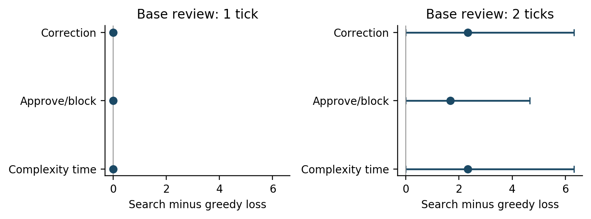

# Stage 6: reviewer authority, operational robustness and ICAART manuscript

**Completed: 24 fresh cases in eight disjoint source bundles, three generation replicates, 72 GPU workflows, 675 successful generation attempts, and 864 verified policy replays.** The primary restricted-authority search-minus-greedy difference is **+1.6667 loss points, 95% paired interval [0.0000, 4.6667], with zero wins, six ties and two losses**. The study gives no search advantage. All 21 unstaged failures remain included. A separate post hoc sensitivity uses the 288 earlier preparations and 3,456 traces, including 1,152 exact historical reference matches.

The official-template [manuscript](../paper/main.pdf), [LaTeX source](../paper/main.tex) and [supplement](../paper/supplement.pdf) form the submission draft. [Reproduction](../paper/STAGE6_REPRODUCTION.md) distinguishes saved-output replay from the exact historical GPU commands. Nothing was pushed, submitted, published or sent to another person.

## Baseline, authorization and preservation

The tree was clean on `main` at Stage 5 commit `189cf517dc06f4bf3008281c0d2966dbceba928b`. Repository instructions and the requested README, Stage 4/5 reports, research draft, core method, adaptation, claim map, related work, implementation and declarations were inspected first. No applicable `AGENTS.md` was found. Existing code and the pinned upstream substrate were reused; new semantics live in separate Stage 6 modules. No historical generator, estimator, configuration, trajectory or result table is changed.

Stage 5 remains **96 evaluation cases, 32 bundles, three replicates, 288 workflows and 1,152 policy replays**. Its two-tick primary remains **+0.2500 [-0.3333, 1.0000], W/T/L 1/29/2**. All one-tick review policies correct its 51 staged errors; the 55 unstaged failures set its loss floor. The positive, null and unfavorable maintenance findings are preserved, including Stage 2's identical greedy/search orders and Stage 4's conditional competition benefit and correctness/cost tradeoff.

The separate [authorization](../artifacts/stage6_robustness/authorization.json) starts **2026-09-10 21:18:02 UTC**, ends **2026-09-11 03:18:02 UTC**, and stops inference by **01:48:02 UTC**, preserving the final 90 minutes. The attempt ceiling is 6,000, with at most one retry per ordinary call and 60 seconds per attempt. The original start remains **2026-09-09 15:38:57 UTC**, with its original 36-hour target at **2026-09-11 03:38:57 UTC**. Historical command clocks are unchanged. This stage is not backdated into a former authorization.

The method/source freeze was committed at **`0fc51a9bbb5ca015650045c1c610cdc8fee27dc3`**, **21:36:34 UTC**, before the first call at **21:37:01.111738 UTC**. The frozen declaration hash is `d424dd70610b834845a3fd1ccff9e5f1a024d296b476aeccef3676bfeba45342`. All 49 frozen source snapshots verify. The baseline inventory checks **13,459 historical artifact, configuration and upstream files byte for byte**.

## Source-based methodological review

[RETAIL_ASSUMPTION_REVIEW.md](../paper/RETAIL_ASSUMPTION_REVIEW.md) separates pinned benchmark behavior, primary platform documentation and constructed assumptions. It examines staging, review authority, renewed confirmation, family-specific processing stages, review duration, consequence weights, exact-state equality and preparation failures. This is **not independent human expert validation**. No expert or retailer was contacted.

The main implications are:

- Upstream mutation tools change local state immediately. Our additional gate validates on a copy and delays posting. It is coherent for a service controlling dispatch, but is an adapter assumption.
- A reviewer that replaces a complete confirmed transaction has stronger authority than one that approves or blocks it. The upstream policy requires confirmation of consequential details; prior confirmation of a wrong proposal does not itself establish consent to a different transaction.
- Cancellation and modification depend on order status. Returns/exchanges create requests rather than complete physical fulfillment. Our common cutoffs do not estimate real retailer lead times. The incurred quantity is a posting/rework consequence within the episode, not necessarily irreversible physical harm.
- Consequence points and review ticks are explicit experimental quantities. Exact database equality can distinguish cases that a domain expert might judge operationally equivalent.
- Unstaged failures occur before this review boundary. Transaction oversight cannot repair an authentication loop, unfinished confirmation, invalid mutation or abandoned workflow.

Primary sources include the [pinned retail policy](https://github.com/sierra-research/tau-bench/blob/59a200c6d575d595120f1cb70fea53cef0632f6b/tau_bench/envs/retail/wiki.md), its tools and validator, and Shopify's [editing](https://help.shopify.com/en/manual/fulfillment/managing-orders/editing-orders), [cancellation](https://help.shopify.com/en/manual/fulfillment/managing-orders/canceling-orders) and [returns](https://help.shopify.com/en/manual/fulfillment/managing-orders/returns/processing-returns) documentation. They support distinctions between operational stages, not our chosen numerical parameters or perfect reviewer accuracy. Precise links and limitations are in the assumption table.

## Frozen source selection and conditions

The [plan](../plan/STAGE6_ROBUSTNESS_PLAN.md) precedes fresh outcomes. The [case audit](../artifacts/stage6_robustness/cases.json) inspects **500 train, 20 dev and 115 test records**, identifies **54 accounts duplicated across source splits**, and excludes every one of the **120 Stage 5 accounts**, including development/pilot and initially audited selections. Source records are considered in train/dev/test order, then ascending source index. Eligibility retains the supported single-transaction families, explicit operational instruction and absence of extra textual output requirements. Annotation checks retain the earlier source-intent rules for order, cancellation reason, payment/refund destination, old/new options, unique available variants and return-item multiplicities. Inclusion never depends on model outputs or scheduler gains.

Unused eligible unique accounts before cross-family reservation number **10 modification, 26 cancellation and 69 return/exchange**. Sixteen bundles are infeasible. The declared eight-bundle fallback reserves modification first, then cancellation and returns/exchanges, deduplicating accounts globally. It selects **24 distinct training cases**. The eight bundles use seeds 62000--62007, with three fresh generation replicates each. Case IDs, exclusions, split provenance and composition are frozen. Public benchmark records and broad templates can have appeared in model training; this is account-disjoint follow-up evidence, not a contamination-free or unseen-template claim.

The same 72 preparations supply **six policies × two capacities × three variants = 864 policy episodes**. Maximum declared preparation cost is 1,008 ordinary calls or 2,016 attempts, below the 6,000-attempt stage ceiling. No placement generation, new calibration, LLM user simulator, model search or additional evaluation was run. Every planned workflow and policy row is retained.

| Condition | Completed review | Expected timely benefit | Kept fixed |
|---|---|---|---|
| Reference | Perfectly restores the annotated transaction and commits it | `p * (4 + W)` | Historical Stage 5 semantics at base duration 1 and 2 |
| Approve/block | Perfectly detects error; approves an unchanged correct proposal or blocks a wrong one | `p * W` | Same duration, arrivals, cutoffs, risk, preparation, objective weights and automatic guards |
| Complexity time | Reference corrective authority; one extra tick when public proposed `item_ids` length is at least two | `p * (4 + W)` if completion is timely | Same arrivals, cutoffs, risk, preparation and weights; no authority interaction |

A block leaves the committed database unchanged, removes the proposal from the queue, prevents later automatic posting, and leaves four points of unresolved service loss. It counts neither as task completion nor correction. Detection accuracy is explicitly one, with labels accessed only when review completes. A review finishing exactly at cutoff is timely. No completed review can erase a consequence already posted. Schedulers receive released typed public requests only. Upstream guards and target-blind preparation checks remain active.

No-review outcomes are mathematically invariant across variants. Restricted authority cannot turn a wrong or unstaged request into a correct task, so correct completions equal the initially correct staged count for every policy. These are semantic checks, not empirical discoveries. Removing the service benefit is not generally a common rescaling because W varies; a focused arithmetic case verifies a possible ranking change.

The frozen retail estimator remains byte-identical with hash `5734f6babfbd33655a76595f001251bd5914d94dde0c0e3401af3fc4a762a581`. Its development-only probabilities and sparse fallback are unchanged. Generation seeds hash the Stage 6 partition, bundle, case, replicate, tool step and retry, independently of policy, variant and execution order. Policies rotate and capacity order alternates. No agent generation follows staging, so sharing preparations isolates scheduling without asserting later retail feedback adaptation.

## Fresh outcomes and primary analysis

All **72 workflows** are retained: **51 staged**, **39 initially correct**, **12 staged errors**, and **21 unstaged failures**. All **675 generations succeed**, with zero retries or failed attempts. The 21 failed preparations consist of **18 step-limit failures and three finishes without a transaction**. A null runtime-exception field does not turn an unstaged finish into success.

The primary comparison is **search minus greedy operational loss under approve/block at base duration two**. Three generation replicates are averaged within each source bundle. The paired percentile interval uses 2,000 bootstrap resamples, seed 20260916, with all matched conditions resampled together. Repeated policy/variant runs are not independent observations.

**Primary result: +1.6667 [0.0000, 4.6667], W/T/L 0/6/2.** The eight individual bundle differences are **0, 0, 0, 0, 0, 0, 1.3333, 12.0000**. The interval is wide and supported by only eight bundles. Its inclusion of zero does not prove equivalence; the unfavorable point estimate does not establish a general population disadvantage.

| Policy | Reference, base 1 | Reference, base 2 | Block, base 1 | Block, base 2 | Complexity, base 1 | Complexity, base 2 |
|---|---:|---:|---:|---:|---:|---:|
| No review | 9.8333 | 9.8333 | 9.8333 | 9.8333 | 9.8333 | 9.8333 |
| FCFS | 3.5000 | 5.5000 | 5.5000 | 7.0000 | 3.5000 | 5.8333 |
| EDF | 3.5000 | 5.5000 | 5.5000 | 7.0000 | 3.5000 | 5.8333 |
| Uncertainty-first | 3.5000 | 3.5000 | 5.5000 | 5.5000 | 3.5000 | 3.8333 |
| Delay-aware greedy | 3.5000 | 3.5000 | 5.5000 | 5.5000 | 3.5000 | 3.8333 |
| Queue-order search | 3.5000 | 5.8333 | 5.5000 | 7.1667 | 3.5000 | 6.1667 |

Means are per three-case run, after equally weighting replicates and bundles. Under restricted authority, every policy completes the same **39/72** initially correct tasks. The primary absolute totals separate processing harm from unresolved service:

| Policy, block/base 2 | Total loss | Service / posting loss | Wrong commits | Blocked unresolved | Unstaged | Reviews | Review ticks | Waiting ticks | Missed useful |
|---|---:|---|---:|---:|---:|---:|---:|---:|---:|
| No review | 236 | 132 / 104 | 12 | 0 | 21 | 0 | 0 | 0 | 12 |
| FCFS | 168 | 132 / 36 | 3 | 9 | 21 | 44 | 88 | 32 | 3 |
| EDF | 168 | 132 / 36 | 3 | 9 | 21 | 44 | 88 | 33 | 3 |
| Uncertainty-first | 132 | 132 / 0 | 0 | 12 | 21 | 42 | 84 | 23 | 0 |
| Delay-aware greedy | 132 | 132 / 0 | 0 | 12 | 21 | 42 | 84 | 23 | 0 |
| Queue-order search | 172 | 132 / 40 | 4 | 8 | 21 | 44 | 88 | 32 | 4 |

All restricted corrections are zero by definition. Mean occupied fractions are 0.688 for search versus 0.658 for greedy; mean waiting per completed review is 0.727 versus 0.548 ticks. Complete outcomes and resource components for all conditions are in [policy_outcomes.csv](../artifacts/stage6_robustness/analysis/fresh/policy_outcomes.csv), [job rows](../artifacts/stage6_robustness/analysis/fresh/jobs.csv), and the supplement. Missed useful opportunities mean a wrong proposal reaches posting without effective timely review; blocked unresolved requests are separate.

Secondary search-minus-EDF under restricted authority is **+0.1667 [0.0000, 0.5000]**, W/T/L 0/7/1. Reference correction and complexity time each give search-minus-greedy **+2.3333 [0.0000, 6.3333]**, W/T/L 0/6/2. All one-tick review-policy comparisons tie on every fresh bundle. There is no multiplicity-adjusted inference for secondary comparisons.



[Vector paired figure](../artifacts/stage6_robustness/analysis/fresh/figures/paired_loss.pdf), [individual bundle differences](../artifacts/stage6_robustness/analysis/fresh/figures/primary_bundle_differences.pdf), and [all paired rows](../artifacts/stage6_robustness/analysis/fresh/paired_comparisons.csv).

## What changes, and why

At one tick, every review policy prevents every staged error in every fresh variant. Full correction and complexity time reach **84 total loss points**, exactly 21 unstaged failures times four. Restricted authority instead leaves all 33 initially unsuccessful requests unresolved, for **132 points**. Blocking cannot overcome that completion floor.

Every fresh approve/block review sequence equals its reference sequence. The smaller primary loss difference under restricted authority therefore arises from the changed preventable consequence, not an observed scheduling improvement. Although the benefit transformation can change rankings in arithmetic tests, it does not change these fresh orders. This distinguishes mathematical possibility from measured behavior.

The complexity change affects **six proposals from four cases**, including two initial errors. At base two, both search and greedy incur **+1/3 mean loss** relative to reference, leaving their paired difference unchanged. Each changes its review sequence in one of 24 runs. This is limited exposure, not evidence that task complexity never matters. The variant intentionally keeps a public omission-induced simplification rather than consulting hidden target length.

Search and greedy actual sequences differ in **6/24** fresh base-two runs; search and EDF differ in **1/24**. On search's saved public states, **19** dispatches have at least two eligible requests and **six** have different greedy/search heads. These repeated dispatches are descriptive counts, not extra statistical units. [Scheduling differences](../artifacts/stage6_robustness/analysis/fresh/scheduling_differences.csv) and [cross-variant orders](../artifacts/stage6_robustness/analysis/fresh/variant_review_orders.csv).

Frozen risk has **Brier 0.171438**, versus pooled **0.179982**, mean prediction 0.25810 and observed staged error 0.23529; **AUROC 0.65812**. The aggregate improvement masks the relevant family ranking:

| Public family/uncertainty bin | Staged examples | Initial errors | Error rate | Frozen probability |
|---|---:|---:|---:|---:|
| Cancellation, flagged | 20 | 0 | 0.0000 | 0.0400 |
| Modification, flagged | 13 | 8 | 0.6154 | 0.2917 |
| Return/exchange, flagged | 18 | 4 | 0.2222 | 0.4762 |
| Each unflagged family | 0 | 0 | Undefined | 0.2424 pooled fallback |

These diagnostics condition on staging and are identical across policies/variants because preparations are shared. They do not refit risk or establish counterfactual performance under a better estimator. Initial valid-error classes include **10 wrong variant mappings and three wrong/incomplete item lists**, with overlap. Automatic guards reject **246** tool calls. [Risk bins](../artifacts/stage6_robustness/analysis/fresh/risk_bins.csv), [mechanism diagnostics](../artifacts/stage6_robustness/analysis/fresh/mechanism_diagnostics.json).

Across the three independently seeded replicates, **eight of 24 cases** have different proposals and **four** have mixed initial correctness. There are **no repeated byte-identical request groups within this fresh run**. These are seeded generation/history differences, not a fresh nondeterminism diagnostic. Historical Stage 4 identical-request action variation remains preserved and separately described.

## Readable examples under the declared first-qualifying rule

Examples are chosen by ascending bundle then replicate under block/base two, never by effect magnitude. [Fresh traces](../artifacts/stage6_robustness/analysis/fresh/examples/TRACES.md) contain actual customer intent, proposed and annotated transactions, committed tool actions and tick events.

- **No fresh benefit qualifies.** The absence is retained.
- **First tie, stage6_00_r0:** both policies approve a correct cancellation by tick two and block an incomplete return by four. A modification finishes without staging. Both losses are eight, comprising two unresolved requests.
- **First unfavorable case, stage6_06_r2:** modification `train:466` proposes a wrong available variant, with arrival 0, cutoff 5, weight 4 and risk 0.2917. A correct cancellation `train:356` has arrival 0, cutoff 2, weight 12 and risk 0.04. Search reviews the cancellation first to preserve an expiring current opportunity. A correct exchange `train:177` arrives at 1 with cutoff 5, weight 8 and risk 0.4762. Search chooses it at tick two, and the wrong modification posts at five. Search loss is eight. Greedy blocks the modification first, then approves the exchange, leaving only four unresolved-service points. The current-queue expectation and later risk ranking jointly explain this failure; the scheduler does not know future arrivals or hidden labels.
- **First preparation failure, train:421 in stage6_00_r0:** the model retrieves an account/order and product variants, but encounters insufficient gift-card balance and an unavailable payment method. It finishes without staging. No runtime exception occurs, yet service remains incomplete and no transaction-review request exists.

The separate saved-data cohort supplies its first positive example at **evaluation_28_r0**, difference **-4**, first unfavorable at **evaluation_09_r0**, difference **+4**, first tie at **evaluation_00_r0**, and first step-limit failure at **train:062 / evaluation_00_r2**. These are identified as post hoc examples in their [trace file](../artifacts/stage6_robustness/analysis/post_hoc_stage5/examples/TRACES.md).

## Separate post hoc Stage 5 sensitivity

All 288 existing preparations and all 32 source bundles are used. No GPU calls are added. All **3,456** policy traces replay, and all **1,152** reference traces equal historical results excluding originally measured planning durations. This is saved-data sensitivity, not new held-out evidence, and is never pooled with the fresh eight bundles.

| Base 2 condition | No review | FCFS | EDF | Uncertainty | Greedy | Search | Search-greedy interval | W/T/L |
|---|---:|---:|---:|---:|---:|---:|---|---|
| Historical correction | 8.3333 | 5.0000 | 4.5833 | 3.4583 | 3.4583 | 3.7083 | +0.2500 [-0.3333, 1.0000] original | 1/29/2 |
| Approve/block | 8.3333 | 6.1667 | 5.9583 | 5.1667 | 5.1667 | 5.2917 | +0.1250 [-0.1667, 0.5000] | 1/29/2 |
| Complexity time | 8.3333 | 5.3333 | 4.8333 | 3.4583 | 3.4583 | 3.9583 | +0.5000 [-0.0833, 1.2500] | 1/28/3 |

The restricted condition completes 182 tasks for every policy. Search blocks 40 errors versus greedy 41; wrong commits are 11 versus 10. Only two of 96 search orders change relative to correction; other restricted policy orders remain the same. At base one, restricted policies tie, while complexity gives search-minus-greedy -0.0833 [-0.2500, 0.0000] and search-minus-EDF +0.1667 [0.0000, 0.5000]. Full all-capacity tables are saved separately.

The Stage 6 bootstrap seed differs from Stage 5's original seed. Recomputing the unchanged reference rows gives upper endpoint 0.9167 rather than 1.0000. This is finite Monte Carlo variation in the resampling approximation, not changed observations. The original primary result and interval remain explicitly preserved. [Post hoc summary](../artifacts/stage6_robustness/analysis/post_hoc_stage5/summary.json), [complete comparisons](../artifacts/stage6_robustness/analysis/post_hoc_stage5/paired_comparisons.csv).

## Runtime, accounting and final service status

The existing authenticated SSH configuration reached `root@38.80.152.248:33513`. The remote checkout remains `/workspace/OverseeingManyLLMs-rtx6000-ada-20260910T002404Z`. Existing environment and cached weights were reused. No new paid resource or model installation was needed.

| Item | Actual setting/evidence |
|---|---|
| Hardware | RTX 6000 Ada, 49,140 MiB total, compute capability 8.9, driver 580.126.20 |
| Model and tokenizer revision | Qwen/Qwen2.5-7B-Instruct, `a09a35458c702b33eeacc393d103063234e8bc28` |
| Runtime | Python 3.11.13, torch 2.8.0+cu128, vLLM 0.10.2, Transformers 4.55.2; nvcc not on PATH |
| Placement | BF16 CUDA matmul and native BF16 verified before/after; serving process uses GPU; `cpu-offload-gb=0`, `swap-space=0` |
| Serving | Separate port 8015, context 16,384, memory reservation 0.4, tensor parallel 1, maximum sequences 1, eager mode |
| Decoding | Temperature 0.3, top-p 1.0, one structured sample per tool turn, at most 512 output / 15,872 input tokens, 14 turns |
| Observed limits | Maximum input 11,369, output 256, attempt 4.993 seconds |
| Calls/attempts | 675 / 675, zero retry, zero failed generation, zero unknown-token record |
| Tokens | 3,495,749 prompt and 58,762 completion |
| Generation timing | Summed HTTP generation time 1,149.669 s; worker span 1,200.660 s |
| GPU process allocation | Stage 6 engine 19,708 MiB before and 20,006 MiB after; these are observations, not exact peaks |
| Host planning | Fresh search: 114 two-eligible dispatches, five subsets each, mean 0.04832 ms, maximum 0.11583 ms |

All 96 original evidence files are inventoried. **No new publication redaction is needed.** Existing Stage 5 redaction provenance is preserved. Raw requests, serialized payloads, responses, seeds, usage, tool events, and failure outcomes remain available. Server generation and token deltas reconcile exactly with raw evidence and the ledger. Historical server counters are unchanged at 51,347 generations, 11,387,315 prompt tokens and 359,645 completion tokens.

The Stage 6 worker finishes at **21:57:01.267553 UTC**; its last generation finishes at **21:57:00.892575 UTC**, well before the reserve. The separate server and both worker processes are absent by **21:59:19.028809 UTC**. GPU compute retains only the original engine PID 8449. Original server PID 7338 is healthy on port 8000, with no queued/running requests. Persistent files, cached weights and the existing environment remain on the pod. Provider billing duration, hourly rate and charges are unavailable; request time is not billed allocation time. [Verification](../artifacts/stage6_robustness/verification.json), [GPU after](../artifacts/stage6_robustness/gpu_after.json), [worker absence](../artifacts/stage6_robustness/worker_absence.json), [original server status](../artifacts/stage6_robustness/runtime_final_original_server.json). A final [completion-time status check](../artifacts/stage6_robustness/runtime_at_completion.json) at 2026-09-10T22:40:03.906026+00:00 again confirms health, unchanged counters and only the original GPU engine.

Across both Stage 1 GPU demonstrations and Stages 2--6, totals are **55,382 scheduled calls, 55,384 generation attempts, two retries, three failed generation attempts, 30,670,869 prompt tokens and 675,797 completion tokens**. Earlier blocked stages made no inference. The failures and retries occur in Stage 5 and remain preserved. The separate [cumulative accounting](../artifacts/stage6_robustness/cumulative_accounting.json) reports stage-by-stage totals and wall clocks including inter-stage gaps. Final elapsed checkpoint is recorded below; no historical timestamp is reset.

Report checkpoint **2026-09-10T22:47:00.172718+00:00**: Stage 6 elapsed **1h 28m 58s**, cumulative wall time **31h 8m 3s** since the original start, with **zero overrun** against the 36-hour target. The final Git commit timestamp marks completion after this checkpoint. The evaluation milestone is `24c379287e1917e0e572442b73456bee4bbcecb7`; the earlier method freeze is recorded above. Only the new Stage 6 clock entry was completed; every earlier clock field remains unchanged.

## Verification, deviations and manuscript completion

Nine focused Stage 6 tests pass for block-without-completion semantics, unchanged correct approval, lateness/equality, preparation scope, public information, variable duration, objective ranking, exact search effort, sparse/frozen risk, account exclusions, paired replicate aggregation and the separate deadline/retry ledger. The nine historical retail semantic tests also pass. [Focused result](../artifacts/stage6_robustness/focused_tests_direction_repair.txt), [historical tests](../artifacts/stage6_robustness/historical_retail_tests.txt).

All 72 new GPU workflows replay from their raw responses and upstream tool transitions. All 864 fresh and 3,456 post hoc policy traces replay. Historical rechecks cover eight Stage 1 GPU traces, 56 Stage 2 live traces plus five stipulated mechanics traces, 192 Stage 3 traces, 3,056 Stage 4 traces, 288 Stage 5 preparations, and 1,152 exact Stage 5 policy reference matches. Existing Stage 4/5 accounting and integrity audits pass with their reports redirected into Stage 6, preserving earlier bytes.

Two post-freeze changes are explicitly bounded:

1. Secondary `task_completed` win/loss labels initially inherited the lower-is-better loss convention. The repair treats more completions as better. **Numeric differences, bootstrap draws/intervals, all simulation outcomes, GPU preparation and the primary loss comparison are unchanged.** Initial tables and exact before/after code hashes are retained in [analysis_direction_repair.json](../artifacts/stage6_robustness/analysis_direction_repair.json). This repair did not redesign any method or trigger inference.
2. A readable example displayed a null exception as `None`. A presentation-only change labels it as a workflow finishing without staging. Selection, source outputs and scoring remain unchanged; [presentation record](../artifacts/stage6_robustness/presentation_adjustments.json).

Routine setup checks included a test-module namespace collision, a historical verifier initially pointed at current rather than L40S executed source, and status-helper path/PID mismatches. These were corrected without extra generation or changes to historical evidence. The L40S source is now verified from its exact historical Git commit. Failed check logs are retained where captured. The manuscript-audit parser also needed Latin-1 decoding for TeX log bytes; its initial encoding failure is preserved and the final audit passes. The status helper initially placed one new failed-status record in the remote Stage 5 directory; its unchanged bytes were relocated under Stage 6 after verifying its creation time and hash, without altering a pre-existing historical file. No scientific condition, case, prompt, seed, estimator or sample size was changed in response to evaluation outcomes.

The compiled main manuscript has **nine pages and 32,226 non-whitespace extracted characters**, with a 168-word abstract. The supplement has **ten pages**, with a 93-word abstract. Both builds have zero overflowing boxes and zero unresolved citations/references, and all fonts are embedded. The main paper and supplement use the **official ICAART 2027 template**, downloaded from the current template page, with class/style/BibTeX files unchanged. The current rules specify 10,000--50,000 non-whitespace characters for regular review submissions, double-blind review and a 12-page ordinary accepted-full-paper allowance. These are different limits. The official pages, archive hash and file hashes are saved. [Venue requirements](../paper/ICAART_REQUIREMENTS.md) document the abstract, typography, disclosure, public-posting and supplementary-material rules.

The bibliography completes verified classical scheduling entries and retains precise comparisons with KnowNo, One Human N Agents, Value of Information, DeCCaF and tau-bench. Conceptual comparisons remain distinct from reproduced baseline mechanisms. AI assistance throughout text/code is disclosed, with section-level credits following the official guidance. No human author identity, funding, conflict declaration or expert review is invented.

The main paper contains the central formulation, maintenance findings, original unfavorable retail primary result, fresh robustness methods/outcomes/uncertainty and limitations. The supplement adds full tables, source composition, resources, trace interpretation and reproduction detail. Every page is rendered and inspected; build diagnostics and page/character/template audits are saved in [manuscript_audit.json](../artifacts/stage6_robustness/manuscript_audit.json). Figures are vector plots of saved measurements. No inference is required to rebuild them.

```bash
bash scripts/replay_stage6.sh
# Optional separate historical recheck, also without inference:
python3 scripts/verify_robustness_history.py
```

## Scientific support and remaining submission decisions

The complete evidence supports an executable formulation and paired empirical analysis of shared review with finite duration and expiring intervention opportunities. Maintenance demonstrates conditional planning benefits and a cost/correctness tradeoff. The practical study shows that order differences and additional reviews need not reduce realized loss. The robustness follow-up separates preventing a wrong posting from completing a task, and exposes the limits of the frozen risk ranking and transaction intervention boundary. Exhaustive scheduling itself, shared oversight and cost-aware deferral are established prior mechanisms.

The fresh retail result is unfavorable, the sample is small, and neither the time proxy nor perfect detection is empirically calibrated. Broad source templates and possible benchmark training exposure remain. Independent domain-expert validation is absent. These limit the claim; they do not invalidate the declared comparison or justify suppressing its result.

Concrete submission work remains with the human authors: review the scientific interpretation and take responsibility for the AI-assisted package; finalize authorship, funding/conflicts and submission declarations; confirm how the venue reconciles anonymous-review disclosure with its acknowledgement wording; and verify whether a regular-paper supplement can be uploaded. No official regular supplementary-upload permission was located, so the supplement is a local companion and the main paper is self-contained. The main paper fits the ordinary full-paper allowance but would require reduction if accepted as an eight-page short paper. No additional experiment is represented as a prerequisite already completed. The single next useful step is a human methodological and manuscript review focused on corrective authority, consequence interpretation and the exact claims before submission.
