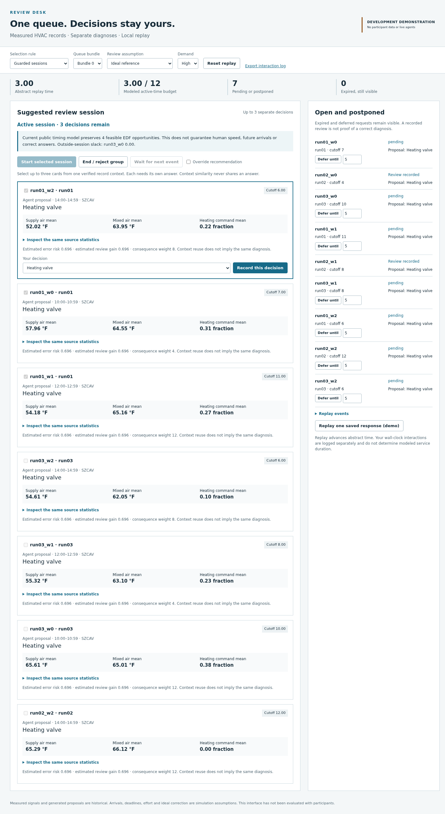

# Review sessions for one user and many agents

**Exploratory follow-up, separate from the completed ICAART paper.** A working
review desk groups up to three related requests while exposing individual
cutoffs, separate decisions and unresolved items. Its strongest simple comparator,
sticky EDF, achieves lower primary loss. The pilot supports a focused interaction
question, not a claim of reduced human workload or novel batching.

- [Pilot report](REPORT.md) and [printable report](REPORT.pdf)
- [Verified literature and comparison matrix](LITERATURE.md), [CSV](comparison.csv), [BibTeX](references.bib)
- [Novelty assessment](NOVELTY.md), [formal method](METHOD.md), [frozen plan](PLAN.md)
- [Human-study protocol, no recruitment](HUMAN_STUDY.md)
- [Saved results and traces](../../artifacts/attention_sessions/)
- [Figure captions and exports](FIGURES.md)



## Run the local prototype

From the repository root on `research/bounded-review-sessions`:

```bash
python3 research/attention_sessions/prototype/server.py --port 9017 \
  --log /tmp/my-review-desk-demo.jsonl
```

Open `http://127.0.0.1:9017`. The server binds only to localhost and needs no model,
network service or external dataset. Choose a policy and use **Reset replay** to
apply the bundle, load and reviewer controls. Start the suggested session, inspect
source statistics and record one diagnosis at a time. Remove or select cards
before starting; check **Override recommendation** for a changed selection.
Defer items in the right-hand queue or end a session. Deferred and expired items
remain visible. **Replay one saved response** is an explicitly scripted option.
Use Ctrl-C to stop the server. The current clock advances through actions; a
real-time human-study driver is future work.

The interface uses Python's standard library and the repository's historical
HVAC parser. Reproduction and figures additionally use NumPy and Matplotlib.
The verified host versions are recorded in `environment.json`. No dependency
installation or model server is required in the existing environment.

## Reproduce saved-output results

```bash
python3 -m unittest research.attention_sessions.test_semantics \
  research.attention_sessions.test_package
python3 -m research.attention_sessions.verify_package
python3 -m unittest discover -s tests -p 'test_hvac*.py'
python3 scripts/reproduce_hvac_analysis.py
```

`verify_package` replays all 4,500 new traces, recomputes analysis in a temporary
directory, compares saved values exactly, verifies the logged UI actions and
checks preservation of all baseline tracked files. The historical command
replays 3,888 prior traces and recomputes tables without overwriting their timing
measurements. No command above calls a model or refits an estimator.

To regenerate derived figures and the printable report:

```bash
python3 -m research.attention_sessions.plot
python3 -m research.attention_sessions.sample_size
bash research/attention_sessions/build_report.sh
```

These commands update only derived files in this research package. The report
build uses Pandoc and pdfLaTeX. Every scientific figure is exported as vector PDF,
editable SVG and 300-dpi PNG. Screenshots are actual browser captures.

The frozen raw run command was `python3 -m research.attention_sessions.evaluate
run`. It refuses to replace an existing evaluation directory. Use `verify_package`
to reproduce it from a completed checkout. The `freeze` command also refuses to
replace the declaration. Do not delete source evidence merely to rerun it.

For the optional browser smoke check, start the local server as above, then run:

```bash
node research/attention_sessions/prototype/browser_smoke.mjs
python3 -m research.attention_sessions.verify_ui_log /tmp/my-review-desk-demo.jsonl
```

The smoke script expects Node with global WebSocket and Google Chrome at the
recorded path `/opt/google/chrome/google-chrome`; it starts and closes its own
headless browser. Adapt that local path if necessary. It writes demonstration
screenshots and a test summary, not participant observations.

## Evidence boundaries

All 18 historical evaluation days were already inspected. Six constructed
queues contain 54 saved windows from one air handler. The 4,500 policy rows do
not increase the number of independent source units. Public sensor summaries
are measured; fault annotations are source-established; model proposals and
individual review responses are historical generations; arrivals, costs,
review times and ideal corrections are simulated. Cached responses cannot
establish behavior under a changed combined presentation.

No human data, new GPU inference, new paid resources or answer propagation were
used. Original clocks, publication-redaction provenance and submission files
remain unchanged. This separately authorized CPU exploration is accounted in
`artifacts/attention_sessions/resource_ledger.json`, outside the original
36-hour experimental window.
