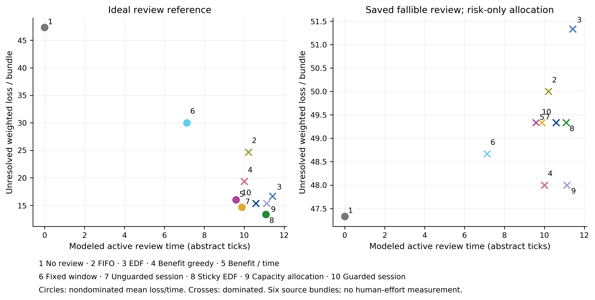
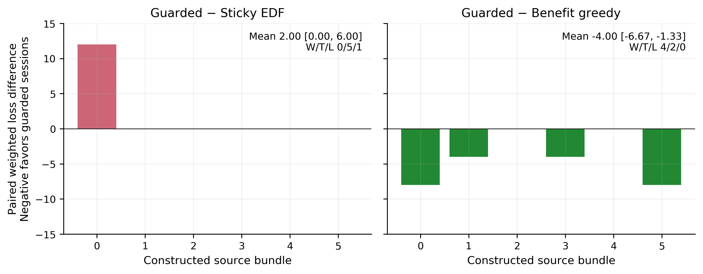
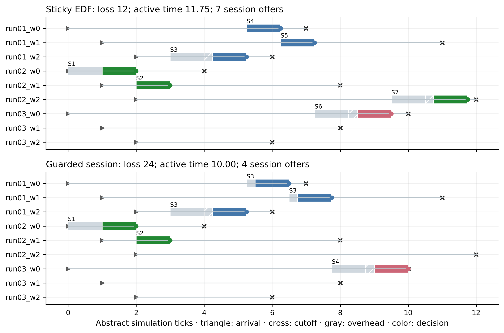

## Finding and recommendation

We implemented a working review desk and tested whether small context sessions
justify a distinct contribution beyond ordinary setup-aware scheduling. The
answer from this pilot is **not a scheduling advantage**. In the declared
primary comparison, guarded sessions have 2.00 more weighted loss points per
nine-request bundle than sticky EDF, with a conditional paired 95% interval
[0.00, 6.00]. They win on no bundle, tie on five and lose on one. They use 0.50
fewer modeled active-time units and offer 1.33 fewer sessions per bundle.
Neither quantity measures experienced mental demand.

The viable follow-up question is whether an editable session, a visible
opportunity-preservation explanation and persistent deferred items help people
maintain control. The present evidence does not establish that interaction
benefit. Keep this direction as **follow-up work**, rather than add a scheduling
superiority claim to the completed ICAART manuscript. The manuscript, main
branch and all historical artifacts remain intact.

## Contribution boundary

The five foundation papers were read through their methods and evaluation,
including the latest available AgentLens version and the published ACL VoI
paper. [LITERATURE.md](LITERATURE.md) gives the comparison matrix, section-level
support, versions, assets and access limitations. [METHOD.md](METHOD.md) gives
the formal specification. [NOVELTY.md](NOVELTY.md) records supported and rejected
claims. Family setup scheduling, notification batching, mixed initiative and
scoped clarification are established mechanisms.

Our prototype offers at most three individually answered requests sharing a
verified record context. It displays a local certificate showing that the
currently feasible EDF continuation remains possible after the proposed
session, under assumed service times. Users can remove cards, change decisions,
reject a session, defer a request, or override the recommendation. Deferred and
expired items remain visible. No answer is copied across diagnoses.

This is a bounded interaction design and an executable falsification test of
its allocation premise. It is not a new exhaustive scheduling algorithm. Sticky
EDF is a strong alternative: retain the current context for one decision when
doing so passes the same certificate, otherwise choose EDF. All policies reuse
context across consecutive singleton reviews. A weak comparator that charged
every isolated notification a new setup would have exaggerated batching's value.

## Evidence and frozen protocol

The source substrate is the historical Stage 7 Berkeley Lab FLEXLAB experimental
air-handler data. Sensor readings are measured. Fault conditions were imposed
and annotated by the source experiment. The four-class diagnostic task, window
representation and Qwen proposals/reviews are inherited from Stage 7. The data
license and transformations remain in its provenance manifests (Figshare article
11752740 version 3, CC0). This exploration downloads no new dataset and generates
no new model response.

The eight old development days supply three mechanics-development queues
(3/3/2 days), producing 30 replays. The main comparison uses **all 18 previously
inspected evaluation day blocks, 54 windows, one physical air handler**. Numerical
source order forms six disjoint constructed bundles of three days and nine
requests. These are six queue-level resampling units, not six independent
facilities. A day label does not guarantee a diagnosable symptom in every hour.
There is no fresh confirmatory sample or measured human workload.

Public grouping uses opaque record identity. The underlying measured windows
remain retrospective: all observations exist before the constructed queue
releases them. Ground-truth labels, original label-bearing names, future arrivals
and saved reviewer answers do not enter scheduling. The saved individual reviewer
answer is released only when its own review finishes. Combined presentation
could change a human or model response; that effect is not identified by reuse.

The [plan](PLAN.md) and
[declaration](../../artifacts/attention_sessions/declaration.json) freeze source
and data hashes, conditions and comparisons before the main CPU run, in commit
`516e01b5`. The 75 conditions comprise 54 core combinations and 21 one-factor
sensitivities. Ten policies over six bundles give **4,500 completed main replays**.
No failed case was replaced and no condition was selected from favorable outcomes.

Core factors are low/high arrival contention, setup cost 0/0.25/1, active budget
6/12/24 and three reviewer assumptions. Per-decision time is 1, group coordination
is 0.25 for every additional card, and switching is 0.25 except at zero setup,
where it is also zero. Primary timing is high contention, setup 1, budget 12 and
ideal review. Cutoff windows 4/7/10 and dimensionless weights 4/8/12 are independently
permuted using declared per-record seeds. All these oversight quantities are
experimental assumptions, not observed HVAC consequences or reading times.

The frozen Stage 7 estimator supplies signed gain for the saved-model condition.
The ideal reference uses its estimated error probability as correctable risk.
A risk-only condition applies that optimistic benefit to the fallible saved
reviewer and is explicitly misspecified. No calibration or response was refitted.

## Primary results

All entries below are means per nine-request bundle, under ideal review and
primary timing. Loss is dimensionless unresolved weighted error. Time is modeled
active time in abstract ticks. A session offer is a controller event, not an
observed interruption. Correctness and effort are separate objectives.

| Policy | Loss | Correct / 9 | Reviews | Active time | Session offers |
|---|---:|---:|---:|---:|---:|
| No review | 47.33 | 3.17 | 0.00 | 0.00 | 0.00 |
| Chronological FIFO | 24.67 | 6.00 | 4.83 | 10.21 | 4.83 |
| EDF | 16.67 | 7.00 | 5.83 | 11.42 | 5.83 |
| Expected-benefit greedy | 19.33 | 6.17 | 4.83 | 10.00 | 4.83 |
| Benefit / time | 16.00 | 6.83 | 5.67 | 9.58 | 5.67 |
| Fixed-window grouping | 30.00 | 5.50 | 3.67 | 7.13 | 3.00 |
| Unguarded sessions | 14.67 | 7.00 | 5.83 | 9.88 | 5.33 |
| Sticky EDF | 13.33 | 7.33 | 6.33 | 11.08 | 6.33 |
| Capacity allocation | 15.33 | 6.50 | 5.33 | 11.13 | 5.33 |
| Guarded sessions | 15.33 | 7.17 | 6.00 | 10.58 | 5.00 |

The capacity-allocation baseline is a declared single-reviewer reduction of
DeCCaF's global cost/capacity allocation, with independent cost estimates and EDF
dispatch. It does not reproduce expert training or multi-expert quotas. VoI,
AgentLens and HiLSVA are conceptual comparisons, not reproduced systems.

| Guarded minus comparator | Mean loss difference | Conditional 95% interval | Wins / ties / losses |
|---|---:|---:|---:|
| Sticky EDF, primary | +2.00 | [0.00, 6.00] | 0 / 5 / 1 |
| Benefit greedy | -4.00 | [-6.67, -1.33] | 4 / 2 / 0 |
| EDF | -1.33 | [-2.67, 0.00] | 2 / 4 / 0 |
| Benefit / time | -0.67 | [-2.67, 1.33] | 2 / 3 / 1 |
| Unguarded sessions | +0.67 | [-1.33, 2.67] | 1 / 3 / 2 |

The primary bundle differences are `[12, 0, 0, 0, 0, 0]`. Bootstrap intervals use
2,000 whole-bundle draws with seed 20260911, sharing resampling indices across
all matched conditions. They are conditional summaries of six constructed
bundles on one apparatus. Exchangeability across source days is unverified;
the intervals support neither equipment-population claims nor equivalence.
Secondary contrasts are exploratory and have no multiplicity-adjusted claim.

Against sticky EDF, guarded sessions reduce mean context changes from 3.00 to
2.67 and repeated context setups from 1.33 to 1.00. They leave 1.83 rather than
1.67 useful opportunities unreviewed. Total waiting time for completed reviews
is 21.21 versus 23.25 ticks per bundle, partly because different reviews finish.
This is not a matched per-decision reading-time effect. Full components and
all conditions are retained in `analysis/policy_summary.csv`.

Unguarded sessions dominate guarded sessions on mean weighted loss and active
time, while guarded sessions make slightly more correct diagnoses and fewer
session offers. That objective tradeoff prevents a single universal ranking.
Fewer offered sessions also need not mean fewer attention shifts: the interface
may still require reading each card.

## Why a session lost

The first unfavorable primary bundle is bundle 0. Both methods first review
`run02_w0` from tick 0 to 2 and `run02_w1` from 2 to 3. All nine requests have
arrived by tick 2. Sticky EDF then completes three `run01` decisions at 5.25,
6.25 and 7.25, changes context for `run03_w0` by 9.50, and completes `run02_w2`
by 11.75. Its loss is 12.

Guarded sessions offer the three `run01` cards together. Their completion times
are 5.25, 6.50 and 7.75 because of coordination overhead. The next context ends
at 10.00, leaving only two budget units for a decision requiring 2.25. It misses
`run02_w2` and incurs loss 24, despite using only four session offers rather
than seven. The local certificate preserved a feasible EDF continuation, which
was weaker than sticky EDF's realized continuation. This failure is not caused
by unknown future arrivals or an incorrect implementation of deadline equality.

The first tied primary bundle is 1. No favorable primary bundle exists. A
separately labeled secondary timeline uses the first numerical bundle where
guarded sessions beat ordinary greedy. Selection rules and missing categories
are saved in `analysis/example_selection.json` and
`analysis/secondary_example_selection.json`; no maximum-effect example is used.

## Sensitivities and ineffective review

At zero setup and switching cost, guarded and sticky EDF tie in loss; guarded
uses 0.083 more time units per bundle. Unrelated contexts, singleton sessions
and high coordination overhead produce identical mean loss and effort.
Imperfect suggestions produce equal loss and 0.042 more time. Disabling context
reuse for all policies produces equal loss and 0.167 more time. These do not
support an effort advantage independent of setup assumptions. The imperfect
suggestion condition tests false fragmentation while canonical record identity
prevents unsafe merging; it does not test a corrupt source-identity registry.

The no-reconsideration ablation matches the primary difference here, so this
dataset does not demonstrate a benefit from checking the queue between session
decisions. Under high contention, increasing the active budget from 12 to 24
does not improve the compared methods' losses: cutoffs still constrain access.
Low contention with budget 24 allows sticky EDF mean loss 2 versus guarded 4.
At high contention and budget 6, greedy and unguarded grouping outperform guarded
on loss. The demand and ablation plots retain all these unfavorable regions.

Using the frozen signed review gain, **every policy in every condition admits
zero reviews**. This preserves the Stage 7 mechanical tie. On the same 54 saved
individual response pairs, the model corrected 1 initially wrong proposal and
harmed 6 initially correct proposals; 19 initial diagnoses were correct and
14 review diagnoses were correct. These historical transitions are not new
generations or human observations.

Under risk-only primary allocation, guarded sessions actually apply one helpful
and four harmful reviews across the six bundles. Mean loss rises from no-review
47.33 to 49.33 and correctness falls from 3.17 to 2.67. All review policies in
this timing have greater mean loss than no review. Shared context cannot make
an ineffective reviewer valuable. The pilot assumes response invariance and
therefore does not test whether a combined presentation changes review quality.

There are no missing or invalid outputs among the 54 source pairs. Failed
proposal/review mechanics, invalid responses, abstentions and harms are tested
separately and retained by the evaluator. The explicit-scope fixture also shows
that a valid recipient scope cannot prevent a wrong shared answer from harming
two downstream requests. It is a stipulated example, not an invented HVAC
dependency or an additional empirical case.

## Prototype and verification

The local interface uses the same evidence cards across selection rules,
expandable source statistics, visible cutoffs, individual decisions, deferral
and override controls. It is an event-driven replay with an abstract clock.
Wall-clock interaction observations are logged separately. Rendering, viewport
exposure, source expansion, decision response time, deferrals, overrides and
context transitions are distinguishable; none proves that text was read.

Browser tests exercised the actual page, including a three-card session, and
saved four screenshots. The final 22-event scripted log replays to identical
public-state hashes. It is labeled development demonstration throughout.
The older 32-event demonstration contains an unmarked development server restart
and is preserved separately; the final logger explicitly records starts.
No participant data have been collected.

Seventeen new semantic/package tests and eleven historical HVAC tests pass.
All 4,500 new traces replay exactly. All 3,888 historical HVAC traces replay,
and five historical tables plus diagnostics recompute exactly, preserving
historical timing measurements. The final audit checks that every baseline
tracked file remains unchanged. A test-import invocation and two plotting
compatibility failures were repaired without changing frozen evaluation
semantics; their logs are retained. A literature date was corrected against
the source history (DeCCaF v3 submitted 19 August 2024).

The saved main controller/planning runtime sums to 2.40 seconds over 4,500
episodes, mean 0.534 ms and maximum 42.0 ms per whole episode on this host. This
includes controller work and is not a planning-only benchmark or human response
time. The broader session includes source reading, implementation, browser
checks, analysis and packaging, recorded separately in `resource_ledger.json`.
New inference calls, tokens, paid resource provisioning and participants are
all zero. Historical cumulative generation accounting is unchanged.

## Next research decision

Proceed to a domain-audited interaction feasibility study, not a larger simulator
sweep. [HUMAN_STUDY.md](HUMAN_STUDY.md) specifies a matched-interface, low/high-load
study, counterbalanced task packets, decision-quality and behavior outcomes,
Raw NASA-TLX and separate perceived-control questions. It requires a real-time
workload driver and observable diagnostic tasks before recruitment. Its sample
size plan uses blinded human pilot variance, not the six CPU bundle differences.

A useful follow-up contribution would show that users understand the limited
certificate, retain individual decision authority and manage postponed requests
with acceptable quality under demand. Failure to improve those outcomes, or
an equal result from sticky EDF with less effort, should stop the stronger
claim. The current negative allocation result identifies that test clearly.
