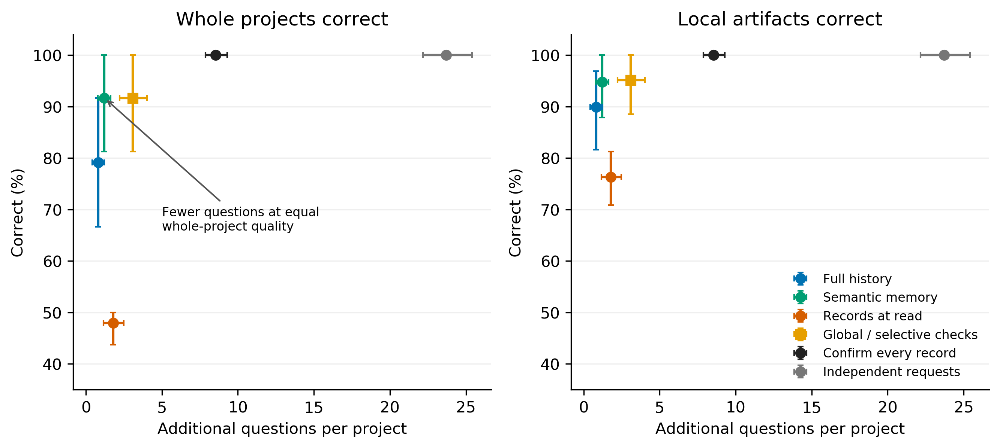
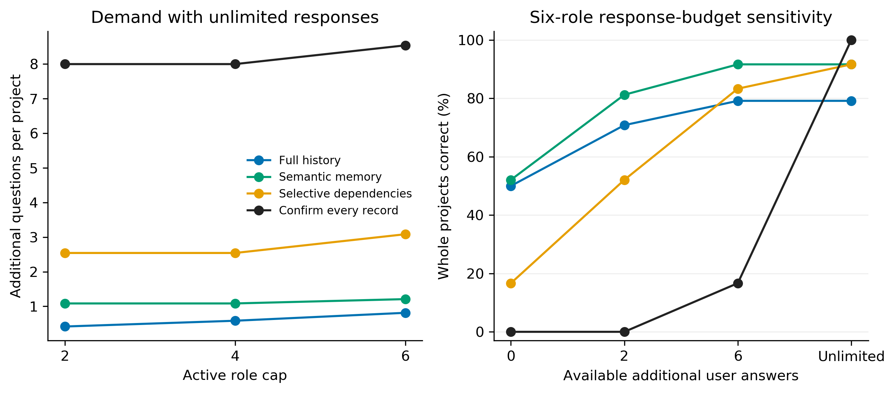
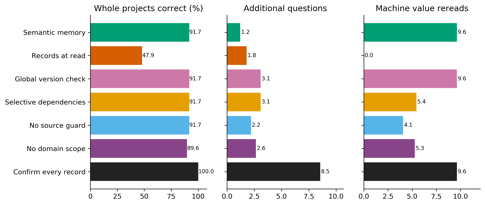
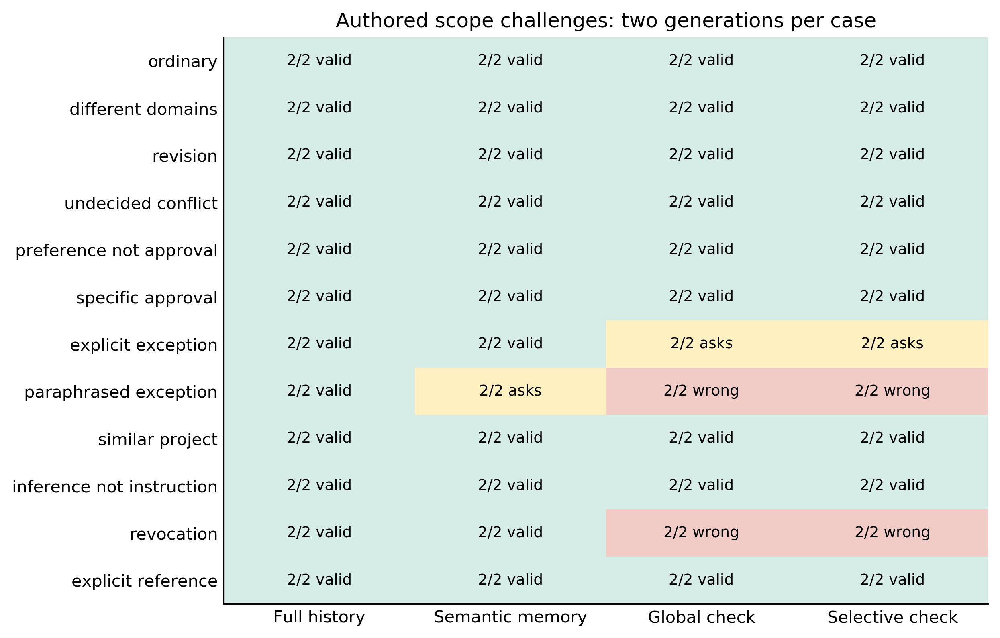
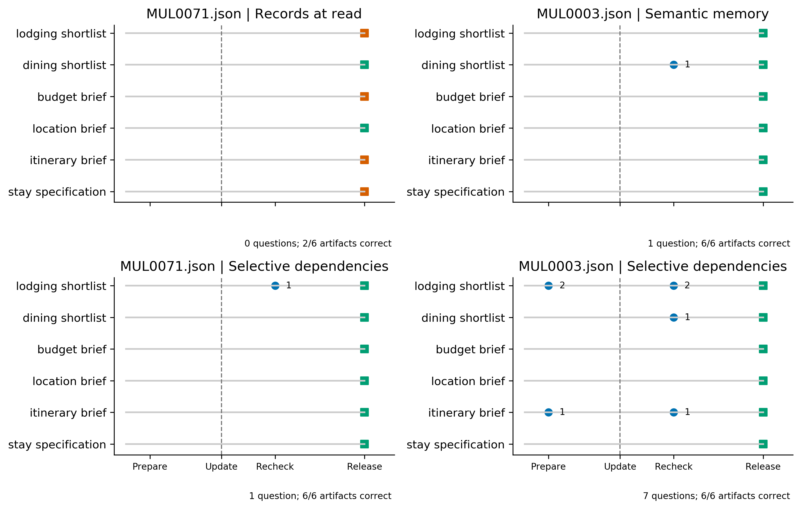
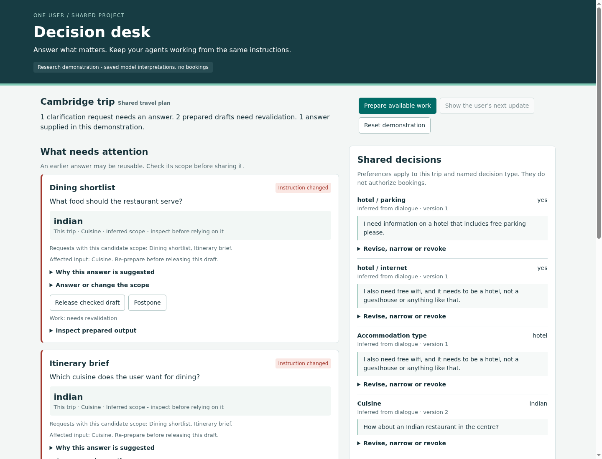

# Finding and practical outcome

A person can now use a local decision desk to answer one planning question for a
stated scope, see which agent drafts can use that answer, make an exception, and
identify drafts needing revalidation after a change. The prototype records the
source and scope of each answer and blocks release of drafts whose registered
decision versions have changed. The demonstration includes actual model
interpretation failures and an explicit request-only exception.

The experiment does **not** support the more elaborate controller as a better
automatic answer-reuse method. On 24 held-out MultiWOZ source dialogues, selective
dependency checking and a competent semantic-memory adaptation completed the same
whole projects correctly. Selective checking required 1.875 more additional
questions per project, with a paired 95% bootstrap interval [1.041, 2.854]. A
simple global version check achieved exactly the same outcomes as selective
checking. The richer structure saved machine rereads, not demonstrated human
effort. On separate authored challenges, full-history answering handled exceptions
and revocation better than the structured extractor.

The useful avenue is therefore **visible, editable user decisions with ordinary
change-consistency checks**, backed by a strong shared-context baseline. Do not
promote the current extractor as reliable automatic authority. This is follow-up
research and a working interaction prototype, not a new scheduling contribution
or an amendment to the completed ICAART submission.

# Research question and closest alternatives

When several agents use a person's requirements, can explicit decision scope and
version checks reduce repeated clarification without spreading incorrect or stale
answers? The distinguishing outcome is whether dependent work still satisfies the
user's current requirements when it is released. Accurate memory retrieval alone
does not establish this property, and version consistency alone does not establish
that an instruction was understood correctly.

Coordinated clarification already appears in [MAC, Sections 3-5](https://aclanthology.org/2026.iwsds-1.1/).
[AgentAsk, Sections 3-5](https://aclanthology.org/2026.acl-long.1294/) addresses
information gaps at inter-agent handoffs. [Mem0](https://arxiv.org/abs/2504.19413)
and [Zep](https://arxiv.org/abs/2501.13956) already extract, update and invalidate
memory. [Value of Information](https://aclanthology.org/2026.acl-long.1987/)
already evaluates whether clarification is worth its communication cost.
[HiLSVA](https://arxiv.org/abs/2606.26614) already combines reusable feedback,
concurrent sessions and provenance. Dependency invalidation is established in
truth maintenance and incremental build systems. None of those mechanisms becomes
new by placing it in an agent interface.

The [literature comparison](LITERATURE.md) identifies inspected sections, released
code revisions, publication status and access limitations. Our all-current-memory
selector is a Mem0-inspired **adaptation**, not a reproduction of Mem0's complete
retrieval/update/graph system. It reconstructs current scalar memories from each
released prefix and gives the selector all of them. Full-history answering is a
separate strong alternative. No baseline receives a deliberately stale memory
store or an artificially restrictive top-k limit.

Three candidates were examined. Demand admission was tested in four controlled
task sets. A simple policy that lets blocked workers yield was strong, and the
proposed human-aware rule made urgent outcomes worse in one case. Resumption
support was retained as a change-impact view, without a separate summary-system
claim. Decision reuse was selected because the source utterances, revisions and
resulting local artifacts could be checked within the budget. The two adaptation
checkpoints and rejected hypotheses are in [DECISIONS.md](DECISIONS.md).

# Evidence, task construction and freeze

## What the source is

The application is a local travel-planning project. People can supply preferences
such as location, price range and accommodation type without specialist expertise.
The source is [MultiWOZ 2.4](https://aclanthology.org/2022.sigdial-1.34/), pinned at
`6807c1d85f547fcaae10494d26991d2d37c90a63`, under its released MIT license. It
contains task-elicited human Wizard-of-Oz dialogues and benchmark database records.
It is not observed use of our system. The 2.4 authors corrected validation/test
annotations; those corrections do not constitute an independent audit of our
constructed tasks. Public benchmark exposure during model training is unknown.

| Evidence layer | Included here | What it establishes |
|---|---|---|
| Source utterances | Released dialogue prefixes with speaker and turn IDs | What the source user or assistant said |
| Source annotations | Corrected belief states, evaluator-only | The benchmark's current constraints |
| Local database | Pinned hotel and restaurant records | Reproducible shortlist queries |
| Authored application | Two source epochs, paraphrased requests, up to six agent roles | A controlled multi-agent adaptation |
| Generated evidence | Qwen extraction, request parsing, full-history and memory answers | Fallible language interpretation |
| Simulated responses | Accurate answers only after explicit questions, within a response budget | Conditional task quality and additional question demand |
| Interface observations | Scripted browser actions and screenshots | Working software, not participant behavior |

Roles prepare lodging and dining shortlists, a price-category brief, a location
brief, an itinerary specification and accommodation requirements. These are
distinct artifacts of **one source project**, not independent user goals. Queries
execute against the local databases. Briefs reflect their consumed constraints.
An empty correctly constrained shortlist is a completed local artifact, not a
successful trip or booking. No purchase or booking is performed.

The frozen screen requires at least four supported final fields across lodging
and dining. Only seven declared attributes are used. User-text lexical support is
required, including explicit star phrases rather than a bare number. Unsupported,
unstated and no-preference fields are excluded by a rule fixed before model
outcomes. A lexical match is not proof of correct domain attribution or entailment.

The main development batch uses eight official validation dialogues. One extra
validation dialogue appeared in the initial probe, so **nine distinct dialogues
were used anywhere in development**. Evaluation uses 24 different official test
dialogues, with the first 12 eligible IDs from each of the retained-change and
stable strata. No generated outcome determined inclusion. The source-ID/text
split check found no exact duplicates. A later source audit found 32 different
hotel/restaurant goal signatures across the main development and evaluation
selection. Including the extra probe dialogue gives 33 distinct goal signatures
across all development/evaluation source IDs. Shared database records, task templates and unidentified source
participants still limit independence. Related role variants stay within the
same dialogue unit.

## Declared comparison

The method, tasks, challenges, prompts, settings, source files and analysis were
frozen in commit `70299a02` at **08:05:47 UTC**, before evaluation generation began
at 08:06 UTC. The declaration and 21 checked hashes are under
`artifacts/decision_dependencies/frozen/`.

The final matrix contains 24 dialogues, two independently seeded preparation
replicates, role caps 2/4/6, response budgets 0/2/6/unlimited, and nine methods.
That is **5,184 paired controller runs**, generated from 48 shared preparations
and 576 final-dialogue calls. At the six-role cap there are 141 nonempty artifacts
per replicate, or 282 per method. Three empty role instances are inactive and
receive no success credit. No source case was dropped. Twelve separately authored
scope challenges have two replicates and 96 calls. They are not additional source
dialogues or human observations.

The structured methods share the same fallible extraction and request parsing.
Full history answers from all released utterances. Semantic memory answers from
all current extracted records. Per preparation, the common cache has two
extractions, two request parsings, four full-history answers and four memory
answers. The methods reuse those outputs across role and response-budget settings.
This holds generated inputs fixed; it does not pretend that each controller row
is a fresh agent trajectory. Baselines differ in the calls their mechanisms need,
and the complete shared call cost is reported rather than charged repeatedly.

An inserted simulated answer is shared within its source epoch. A new source
prefix invalidates temporary answers conservatively. We do not generate an
alternative historical conversation after an inserted answer. This choice can
create unnecessary repeat questions, and limits claims about continuous real use.
The prototype's explicit online overrides are separately tested user events.
No operational deadlines or user response durations are invented for this task.
Completion refers to release of checked local artifacts, not elapsed human time.
Deadline misses and experienced workload therefore have no measured values here.

The co-primary descriptive outcomes are whole-project correctness and additional
questions for selective checking minus semantic memory, at six roles with
unlimited responses. All quantities are kept separate. Replicates are averaged
within dialogue before 2,000 paired bootstrap resamples with seed 91831, stratified
by retained change. All matched conditions use the same resampled dialogue
indices. The sample was deliberately balanced for change, so these intervals
describe a small selected sample, not the natural frequency of instruction changes.

# Mechanism and information boundary

A candidate record contains a project, domain, attribute, value, user-source turn
and quote, inferred or confirmed status, version and explicit exceptions. A
separate model call interprets request scope from its wording. A source guard
checks the schema, user role, turn and quotation. Explicit conditional phrases
cause abstention. It is a conservative lexical rule, not a semantic scope proof.
Automatic extraction represents scalar domain/attribute values; fine-grained
exceptions must be recognized as uncertain or supplied explicitly by the user.

Each artifact registers the decision versions it consumed. A changed or revoked
record invalidates dependent work. Selective checking rereads stale dependencies
before release. The global baseline rereads all current inputs after every source
epoch. Both should produce identical final values under the same records and
deterministic artifact functions. A simpler read-only record baseline deliberately
has no release check, exposing the established stale-cache failure.

The guarantee concerns stored versions and registered dependencies. It does not
repair a misunderstood instruction, discover an omitted dependency or prevent an
integrator from bypassing the release check. An actual quotation can support an
outdated interpretation. A preference is never general action approval. Approval
requests use a common request-specific guard in all challenge methods, so those
challenge successes are credited to an automatic safeguard, not a unique
advantage of the proposed method.

Only released source text, public project context and current requests enter model
calls. Target answers and future turns are withheld. The workload builder uses
annotations to choose already stated required fields, as an explicit task
construction step. The request parser does not receive those correct scope
labels. Evaluator values enter the controller only as an explicitly requested
simulated user answer. A regression check changes hidden answer values while the
response budget is zero and confirms unchanged controller events and outputs.

# Results

## Quality and additional decisions

The table reports totals across 48 source-replicate preparations. **The statistical
unit remains 24 dialogues.** All rows use the six-role cap and unlimited additional
answers. Every method has 282 nonempty local artifacts to complete.

| Method | Correct projects / 48 | Correct artifacts / 282 | Additional questions | Incorrect answer uses |
|---|---:|---:|---:|---:|
| Independent requests | 48 | 282 | 1,138 | 0 |
| Full history | 38 | 253 | 39 | 47 |
| Semantic memory | 44 | 267 | 58 | 31 |
| Records at read | 23 | 215 | 86 | 77 |
| Global version check | 44 | 268 | 148 | 22 |
| Selective dependencies | 44 | 268 | 148 | 22 |
| No source guard | 44 | 267 | 105 | 25 |
| No domain scope | 43 | 264 | 127 | 34 |
| Confirm every new record | 48 | 282 | 410 | 0 |

Source: `interpretation/primary_totals.csv`. Incorrect answer uses include initial,
final and retained uses, so they are not identical to incorrectly released
artifacts. No unresolved artifacts remain in this unlimited-response reference.
Finite-budget outcomes retain unresolved work below.

Selective checking and semantic memory have the same whole-project correctness
for **all 24 paired dialogue means**. Their empirical difference and bootstrap
interval are [0, 0, 0]. A degenerate interval reflects identical observed paired
values; it is not proof that the methods are equivalent on future cases. The
selective method asks 3.083 questions per project versus 1.208 for semantic memory.
The paired difference is +1.875 [1.041, 2.854], with fewer questions on 2 dialogues,
a tie on 4 and more questions on 18.

Artifact accuracy differs by only +0.347 percentage points on the dialogue-mean
scale, with a 95% interval [0, 1.042]. One dialogue favors selective checking and
23 tie. This small artifact difference disappears in the normalization sensitivity
below. The outcome does not establish an automatic reuse advantage.



*Figure 1. Generated interpretations and simulated additional responses on 24
source dialogues. Two replicates are averaged within dialogue. Bars are
dialogue-level bootstrap intervals. The axes show distinct outcomes, not a
combined utility or observed mental workload. Independent asking is dominated
in the plotted means by confirmed sharing; other methods trade quality against
questions. The vertical axis begins at 35 percent for readability.*

## Demand and limited responses

With only two additional answers available per project, semantic memory completes
39/48 whole projects and 250/282 artifacts correctly. Selective checking completes
25/48 projects and 193/282 artifacts. It leaves 81 artifacts unresolved, versus
17 under semantic memory, and releases 8 incorrect artifacts versus 15. Its paired
whole-project difference is -29.17 percentage points, with a 95% interval
[-47.92, -10.42]. The controller's caution lowers some wrong completions but
consumes scarce responses and leaves substantially more work unfinished.

With six responses available, selective checking still leaves nine artifacts
unresolved and completes 40/48 projects, while semantic memory already reaches
its unlimited-response outcome of 44/48. Confirming every new record attains
perfect quality only in the unlimited-response reference. At a six-answer budget
it leaves 154/282 artifacts unresolved. Suppressing wrong releases through
excessive confirmation is not free progress.



*Figure 2. Constructed role counts and response budgets applied to identical saved
outputs. The budget counts additional simulated answers, not source utterances or
seconds. Whole-project correctness includes unresolved work as failure. Global
checks coincide with selective checks and are omitted as a duplicate curve.*

The distinct-question accounting also rejects a superficial sharing claim.
Selective checking asks for 98 distinct underlying key/value decisions and repeats
50 of them across the 48 preparations. Semantic memory asks for 49 distinct
decisions and repeats nine. Both substantially reduce the independent-asking
reference, but the semantic baseline is more frugal. One answer is counted once
only when its explicit scope actually permits reuse. A display containing several
separate questions does not receive a one-decision discount.

## What version checks contribute

Records without a release check recover none of the 58 changed-field uses across
the source-replicate preparations. Selective, global and semantic-memory methods
recover all 58 in the unlimited reference. Full history recovers 54. These counts
refer to retained benchmark changes between the selected epochs, not every earlier
change anywhere in the conversation.

Global and selective checks have identical artifacts, questions and answered
questions in **every matched demand/budget/replicate condition**, verified directly
from traces. Selective checking reduces repeat value reads from 462 to 261, a
43.5% reduction. These are cheap host operations. The full controller simulations,
including local artifact scoring, have median 1.87 ms and p95 2.99 ms per row on
this host. There is no measured human-reading saving to offset the additional
questions versus semantic memory.



*Figure 3. Frozen ablations with six roles and unlimited accurate responses.
Questions and machine rereads are per-project means. The simple global check
matches selective quality and question demand. Removing domain scope worsens
correctness. Removing source checks asks fewer questions with almost unchanged
quality. These are generated/model and simulated/controller outcomes.*

The declared inspection sensitivity assigns 0, 0.25 or 1 additional assumed
inspection equivalent per distinct candidate source, without claiming people
actually inspect each card. At zero cost, selective checking needs 3.083 units
versus 1.208 for semantic memory. At 0.25 it needs 4.729 versus 3.328. At one it
needs 9.667 versus 9.688, essentially tied. A presumed large inspection saving
can erase the question disadvantage, but this is an assumption requiring actual
interaction evidence. It is not an observed advantage.

## Language interpretation and propagated mistakes

The request parser correctly maps 624/672 public field queries and abstains on
48. Every abstention concerns the first accommodation-type paraphrase. Structured
methods therefore face a systematic applicability gap even though the question
is simple. Raw records supply 328/384 evaluated state fields, with nine incorrect
values. Source checks reduce supply to 269/384, with six incorrect values. Correct
coverage falls from 319/384 to 263/384. The resulting precision change is small
relative to the coverage loss. A source quote alone does not solve stale meaning.

The two generation replicates produce different guarded states on 10/24 source
dialogues, differing on 23 of 145 compared field positions. This is sampling
variation, not a repeated-identical-seed reproducibility claim. Policy comparisons
use the same saved replicate. Deterministic replay does not imply deterministic
fresh generation.

At the six-role unlimited setting, all structured/semantic-memory project failures
are concentrated in three source dialogues. Two contain the phrase `center of
town`, which the frozen adapter fails to map to its database value `centre`.
The remaining dialogue, MUL1376, changes from an expensive hotel to a cheap
guesthouse. The extractor retains the original expensive price. Both replicates
propagate this stale preference into four derived artifacts. Full-history and
memory systems also have their own interpretation errors; no method's outputs
were substituted or repaired in the primary tables.

A **post hoc hypothetical adapter repair** maps only `*.area: center of town` to
`centre`, recomputes local artifacts, and preserves every controller decision and
question. Semantic memory and both version checks then each complete 46/48
projects and 274/282 artifacts correctly. The remaining eight incorrect artifacts
are the genuinely stale-preference failures. This sensitivity eliminates the
one-artifact selective advantage, while retaining its 90 additional questions.
It does not replace the frozen evaluation or constitute a fresh repaired run.

## Exceptions, revocation and authority

The twelve authored cases probe ordinary sharing, domain differences, revisions,
conflict, approvals, exceptions, another project's instruction, agent inference,
revocation and an explicit cross-domain reference. They are a separate controlled
layer and receive no population interval.

| Method | Correct automatic answers | Appropriate abstentions | Wrong transfers | Unnecessary questions |
|---|---:|---:|---:|---:|
| Full history | 14 | 10 | 0 | 0 |
| Semantic memory | 12 | 10 | 0 | 2 |
| Global check | 10 | 8 | 4 | 2 |
| Selective check | 10 | 8 | 4 | 2 |

Each row represents 12 authored cases times two generations. A revocation and a
paraphrased workshop-evening exception fail in both replicates under the
structured methods. The earlier cheap value has a real source quotation, but is
no longer the correct answer to the current question. Full history handles all
these cases. This is direct evidence against equating explicit record fields with
successful language-level scope recognition.



*Figure 4. Generated interpretations of twelve authored cases, with two replicates
per case. Green includes correct automatic answers and appropriate abstentions.
Yellow is an extra question when an answer exists. Red is an incorrect transfer.
The common approval guard is enabled in every method. These are not participant
responses or independent MultiWOZ dialogues.*

## Readable benefit, tie and failure

The first qualifying benefit over read-only records is MUL0071, replicate 0.
Selective checking releases all six artifacts correctly after the source update,
with one extra question. The read-only baseline asks no questions but releases
four incorrect artifacts. The same benefit is supplied by the global check and
does not distinguish a new algorithm.

The first quality tie with greater question demand is MUL0003, replicate 0.
Semantic memory asks one question, while selective checking asks seven. Both
release all six artifacts correctly. This is a concrete unfavorable demand
example. There is no qualifying unlimited-response artifact-quality loss against
semantic memory in the frozen selection rule, and that absence is reported
rather than replaced by a more dramatic case.



*Figure 5. Logical phases and per-role question counts on matched saved inputs.
Source utterances are task-elicited, interpretations generated, and role execution
simulated. Green/red squares indicate correct/incorrect local releases. Horizontal
spacing is not measured user response time. Examples use first-qualifying source
IDs, not the largest effect.*

The explicit failure walkthrough is the authored revocation case. The source user
withdraws a cheap-hotel preference and supplies no replacement. The extractor
returns the old cheap value. The version controller consistently propagates that
incorrect stored interpretation. A user pressing the interface's **Revoke** button
does invalidate registered work correctly. Those are different tests: explicit
structured revocation works, automatic understanding of a revocation failed.

# Working prototype and verification

The interface shows pending questions, candidate earlier answers, provenance,
inferred versus confirmed scope, affected work, deferrals and explicit overrides.
It distinguishes request-only answers from named shared scope. A conference-night
exception cannot silently inherit or widen the ordinary answer. Unknown scope
stays unresolved until the user supplies it. Changed instructions mark stale
drafts, and the release endpoint enforces revalidation. Already released events
remain in the audit trail.



*Interface screenshot. A scripted browser demonstration using saved development
outputs. It records no participant behavior. The interface deliberately shows
unresolved extraction failures and affected drafts.*

Run from the repository root:

```bash
python3 research/decision_dependencies/prototype/server.py --port 9027
```

Open `http://127.0.0.1:9027`. The [walkthrough and Python adapter](API.md) show how
several roles submit requests, consume a scoped answer and check work release.
The interface uses saved development outputs, not new inference. External agents
may supply candidate scope, which remains a hypothesis. The API does not silently
run a model for arbitrary new text or authorize external actions.

Interaction logs record displayed cards, source inspection, answers, scope
choices, changes, rejected operations, deferrals, overrides and time since a card
was shown. Those scripted timings are not reading time or mental workload.
The [human-study protocol](HUMAN_STUDY.md) compares the same strong shared-memory
and consistency backend with or without explicit scope/change receipts. Its
eventual participant sample size must come from actual pilot variability and a
declared precision target, not from the 24 source dialogues here.

Twenty-four focused tests pass. They cover label isolation, source boundaries,
exceptions, approval scope, explicit revocation, stale release handling, online
override atomicity, response budgets, attempt/cutoff limits, global/selective
equivalence and raw accounting. The browser walkthrough passes actual form
submission, shared answers, source changes, stale-release rejection, independent
exceptions, deferral, mobile overflow and no JavaScript exceptions. Historical
attention-session tests passed (17), and all 18,759 files tracked at the starting
commit remain unchanged.

Saved-output reproduction checks all 5,184 canonical traces, episode CSV and five
frozen analysis tables. It reconstructs 56 main development/evaluation preparations
and 24 challenge preparations from raw responses, checks 768 complete
prompt/seed/setting payloads, and replays all 120 challenge comparison rows. The
16 earlier probe calls remain fully accounted raw evidence. A separate download
audit reconstructs the pinned source selection and verifies exact selected bytes.

One command reproduces results and figures without a GPU or network:

```bash
python3 -m research.decision_dependencies.reproduce --figures
```

It writes to `/tmp/decision-dependencies-replay`, preserving original evidence.
The five report figures have vector PDF/SVG and 300 dpi PNG exports, source hashes
and captions under [publication/](../../artifacts/decision_dependencies/publication/). Frozen
diagnostic figures also remain in `evaluation/figures/`. The post hoc area-alias
and inspection-cost analyses are explicitly separate in `interpretation/`.

# Resources and limits

The separately authorized session began **2026-09-11 07:16:21 UTC**, with a hard
stop at 10:16:21 UTC and an inference cutoff at 09:46:21 UTC. Actual generation
finished at **08:33:00 UTC**. No new resource was provisioned. The existing
RTX 6000 Ada and vLLM server were reused with pinned Qwen2.5-7B-Instruct revision
`a09a35458c702b33eeacc393d103063234e8bc28`, BF16, one GPU, zero CPU offloading and
serial requests. Temperature is 0.3, top-p 1.0, context limit 2,048, and output
limits 768 for extraction and 384 for other calls. JSON object formatting is a
separately recorded application setting. The earlier unconstrained failures remain.

| Phase | Calls / attempts | Prompt tokens | Completion tokens |
|---|---:|---:|---:|
| Development and format probes | 112 / 112 | 59,419 | 14,544 |
| Final dialogue preparations | 576 / 576 | 286,180 | 60,449 |
| Authored scope challenges | 96 / 96 | 17,460 | 1,912 |
| Total | **784 / 784** | **363,059** | **76,905** |

There were zero transport failures, zero retries and zero context-limit rejections.
Three responses were unparseable. One final extraction hit its 768-token limit;
two original development probe outputs were malformed despite normal stop reasons.
Every failed output remains in the raw data and dependent accounting. Final
dialogue calls averaged 2.30 seconds, with interpolated p95 4.10 seconds. The sum
of generation-attempt durations is 1,699.43 seconds, or 28m 19s. This is measured
request duration, not a billed allocation measurement or user inspection time.

Server counter differences match all **784 requests, 363,059 prompt tokens and
76,905 completion tokens exactly**. The existing model server remains healthy
and idle; the temporary SSH tunnel was stopped after collection. Final local
process cleanup and session elapsed time are recorded in `resource_ledger.json`.
Provider billing rate and remaining allocation balance were unavailable.

Cumulative available accounting is 56,370 scheduled calls, 56,372 attempts,
31,159,693 prompt tokens and 761,833 completion tokens. The original start and
36-hour deadline remain 9 September 15:38:57 UTC and 11 September 03:38:57 UTC.
This new session occurs **outside that original window under new authorization**.
The final ledger reports wall time since the original start, including inter-session
gaps, and the overrun explicitly. It does not reset historical clocks or describe
new work as part of the original 36 hours.

# Recommendation

Keep the working decision desk and simplify the automatic backend around a strong
shared-memory or full-history interpreter with a global change barrier. Retain
explicit user scope, request-only answers, revocation and visible affected work.
Selective dependencies can remain an optional engineering optimization if larger
artifacts make rereads expensive. This pilot does not justify them as an attention
or quality improvement.

The specific research lesson is that **consistency of a stored instruction is
different from correctness of its interpretation**. Conservative extraction can
increase supervisory demand enough to reduce completed work when answers are
scarce. Familiar memory and a simple consistency check are essential comparators.
The clearest next test is whether explicitly capturing a user's intended scope
and showing change-impact receipts improves real interaction over the same
competent backend. The current package makes that test possible without claiming
it has already measured comprehension, control or cognitive load.

Treat this direction as follow-up work. Keep the completed ICAART submission
intact. Its unfavorable retail results, the HVAC primary mechanical tie, harmful
model review, ideal EDF/search tie and lower greedy review count remain unchanged.
They motivate attention-value questions but do not validate the new interaction.
